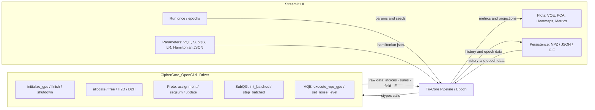

# Tri-Core Orchestrator **ULTRA**

**A (Proto/DL) + B (SubQG) + C (VQE)** – Interaktive GPU-Workbench für deinen `CipherCore_OpenCl`-Treiber

[](#)
[](#)
[](#)
[](#license)

Eine **lokal lauffähige Streamlit-Anwendung**, die drei Rechenpfade **sichtbar koppelt**:

- **A – Proto/DL:** GPU-Zuordnung ➜ segmentierte Aggregation ➜ Prototyp-Update  
- **B – SubQG:** myzelartige Feldsimulation (Batches) mit **Konfidenz-Metriken** (Mean/Std/Sigma)  
- **C – VQE:** Variational Quantum Eigensolver (SPSA) mit **frei editierbarem Pauli-Z-Hamiltonian**

Die Kopplung sorgt für **geschlossene Rückkopplungsschleifen**:

- **Feld-Score →** moduliert **Lernrate** (LR) der Prototyp-Updates  
- **VQE-Energie →** moduliert **Rauschpegel** im Treiber (`set_noise_level`)

> **Ziel:** Eine **reproduzierbare**, **performante** und **didaktisch klare** Experimentier- und Demo-Umgebung, die klassische Lernverfahren, feldbasierte Emergenz und quanteninspirierte Optimierung **in einem UI** erlebbar macht.

---

## Inhaltsverzeichnis

- [Features](#features)
- [Schnellstart](#schnellstart)
- [Voraussetzungen](#voraussetzungen)
- [Installation](#installation)
- [Starten](#starten)
- [Benutzung (UI-Leitfaden)](#benutzung-ui-leitfaden)
- [Architektur](#architektur)
- [Testumgebung & Validierung](#testumgebung--validierung)
- [Treiber-API (ctypes-Bindings)](#treiber-api-ctypes-bindings)
- [Parameter & Kopplung](#parameter--kopplung)
- [Exports & Formate](#exports--formate)
- [Benchmarks & Auto-GPU](#benchmarks--auto-gpu)
- [Troubleshooting](#troubleshooting)
- [FAQ](#faq)
- [Lizenz](#license)
- [Zitieren](#zitieren)

---

## Features

- **Tri-Core-Kopplung**: A (Proto/DL) ↔ B (SubQG) ↔ C (VQE) in einem konsistenten Ablauf pro Epoche  
- **VQE-Editor**: Hamiltonian als **JSON** (Pauli-Z-Terme: `{"z_mask": int, "c": float}`) – Validierung im UI  
- **Konfidenz-Heatmaps**: Mean/Std/Sigma aus mehreren SubQG-Samples pro Epoche  
- **PCA-Visualisierung**: Vorher/Nachher, Δ-Pfeile, **Trajektorien** einzelner Prototypen, **GIF-Export**  
- **Persistenz**: **.npz**-Sitzungen (History + Epoche-Daten + Parameter) laden/speichern  
- **Robustes UI**: Ein-Epoche-Fälle ohne Streamlit-Fehler (Slider-Fallbacks, Singleton-Plots)  
- **GPU-Werkzeuge**: GPU-Liste, Micro-Benchmark, **Auto-Auswahl** der schnellsten GPU  
- **Lokaler Datenschutz**: Keine Cloud, alles offline

---

## Schnellstart

```bash
# 1) Repo klonen und in den Ordner wechseln
git clone <DEIN_REPO.git>
cd <DEIN_REPO>

# 2) Virtuelle Umgebung (empfohlen)
python -m venv .venv
.venv\Scripts\activate

# 3) Abhängigkeiten
pip install -r requirements.txt

# 4) Streamlit App starten
streamlit run streamlit_tri_core_ultra.py
````

> **Hinweis (Windows-Pfad):** Lege die `CipherCore_OpenCl.dll` in deinen Projektordner oder trage den absoluten Pfad im **Sidebar-Feld „DLL-Pfad“** ein.
> **URL-Parameter:** Der **GPU-Index** wird in der URL gehalten (`?gpu=0`). Der **DLL-Pfad** bleibt **nur** im Session-State.

---

## Voraussetzungen

* **Python 3.12**
* **Windows 10/11**
* **GPU mit OpenCL** (AMD, ggf. weitere – abhängig vom Treiber)
* **Dein Treiber/DLL:** `CipherCore_OpenCl.dll`

**Python-Pakete (Kern):**

`streamlit`, `numpy`, `matplotlib`, `plotly`, `imageio`, `Pillow`, `pytest` (für Tests), optional `pytest-cov`

Beispiel-`requirements.txt`:

```txt
streamlit>=1.36
numpy>=2.0
matplotlib>=3.9
plotly>=5.22
imageio>=2.34
Pillow>=10.3
pytest>=8.2
pytest-cov>=5.0
```

---

## Starten

```bash
streamlit run streamlit_tri_core_ultra.py
```

* **Sidebar**: DLL-Pfad setzen, GPU-Index wählen/prüfen, VQE-/SubQG-/LR-Parameter einstellen
* **Run once**: startet **eine** Epoche
* **Run epochs**: führt mehrere Epochen sequentiell aus

---

## Benutzung (UI-Leitfaden)

### 1) Einstellungen (Sidebar)

* **DLL-Pfad**: stabil nur im Session-State (kein Query-Param, robust gegen Windows-Pfade)
* **GPU-Index**: Zahleneingabe; in der URL (`?gpu=N`) aktualisiert
* **GPU-Werkzeuge**:

  * **🧭 GPUs auflisten** – probiert Indizes durch & zeigt verfügbare Geräte
  * **📊 GPU-Benchmark** – Micro-Bench (Assignment + Segmented Sum)
  * **🏎️ Schnellste GPU wählen (Auto)** – misst Kandidaten & setzt besten Index
* **VQE/SPSA**: `Qubits`, `Layers`, `SPSA-Iterationen`
* **SubQG Konfidenz**: `Samples pro Epoche` (für Mean/Std/Sigma)
* **LR-Kopplung**: Modus (`exp`, `sigmoid`, `tanh`, `linear`) + Parameter
* **Hamiltonian (JSON)**: Pauli-Z-Terme editieren & validieren

### 2) Live-Ansicht (Main)

* **VQE-Plot**: Energie pro Iteration (SPSA-Verlauf)
* **Metriken**: Feld-Score, bestE, modulierte LR, gesetztes Noise, ΔProto-L2 gesamt
* **Zeitverlauf**: Linienplots für Feld-Score & ΔProto-L2 über Epochen
* **PCA-Bereich**:

  * Vorher/Nachher-Scatter + Δ-Linien
  * **Trajektorie eines Prototyps** über Epochen
  * **GIF-Export** der PCA-Zeitreihe
* **Heatmaps**:

  * Tabs: **Mean**, **Std**, **Sigma = |mean|/std**
  * **Historie-Raster** der letzten N Epochen (Mean)
* **Per-Proto-Metriken**:

  * Tabelle (sortierbar nach Δ-Embedding oder Δ-PCA)
  * Balkendiagramme je Epoche

### 3) Persistenz

* **💿 Speichern (.npz)** – komplette Sitzung inkl. Parameter
* **📥 Laden (.npz)** – rekonstruiert History, Epoche-Daten und UI-Parameter

---

## Architektur



**Ablauf pro Epoche (vereinfacht):**

1. **Assignment** (A1) → **Segmented Sum** (A2) → **Update** (A3, konstante LR)
2. **SubQG**-Batch-Samples → **Feld-Score** (mean) & **Std** → **LR-Modulation**
3. **VQE (SPSA)** → **bestE** → `set_noise_level()` im Treiber
4. **Zweites Update** (A4, modulierte LR)
5. **Metriken/Plots**: Δ-L2 gesamt, Per-Proto Δ(Embedding/PCA), PCA-Vorher/Nachher, Heatmaps, VQE-Kurve

---

## 🧪 Testumgebung & Validierung

Ziel: **Fehler früh finden**, Treiber/DLL **sicher** initialisieren, Datenpfade und Kopplungen **deterministisch** prüfen.

### Env-Variablen

* `CIPHERCORE_DLL` – Pfad zur `CipherCore_OpenCl.dll` (falls nicht im Projektordner)
* `CIPHERCORE_GPU` – gewünschter GPU-Index (Standard: `0`)

PowerShell-Beispiel:

```powershell
$env:CIPHERCORE_DLL="G:\Tri-Core-Orchestrator-ULTRA\build\CipherCore_OpenCl.dll"
$env:CIPHERCORE_GPU="0"
```

### Pytest ausführen

```bash
# komplette Suite (DLL + Orchestrator)
pytest -v

# nur die UI/Orchestrator-Tests
pytest -v tests/test_streamlit_tri_core_ultra.py

# mit kurzer Zusammenfassung
pytest -rs
```

**Beispiel-Ergebnis (Lokal):**

```
================================================= 14 passed in 17.9s ==================================================
```

### PowerShell-Runner

`tests/run_tests.ps1` (nutzt obige Env-Variablen, setzt sinnvolle Defaults):

```powershell
param(
  [string]$Dll = $env:CIPHERCORE_DLL,
  [int]$Gpu = [int]($env:CIPHERCORE_GPU | ForEach-Object { if ($_ -ne $null) { $_ } else { 0 } })
)

if (-not $Dll) { $Dll = (Join-Path $PSScriptRoot "..\build\CipherCore_OpenCl.dll") }
Write-Host "Using CIPHERCORE_DLL=$Dll"
Write-Host "Using CIPHERCORE_GPU=$Gpu"

$env:CIPHERCORE_DLL = $Dll
$env:CIPHERCORE_GPU = "$Gpu"

pytest -q tests/test_streamlit_tri_core_ultra.py
```

**Runner starten:**

```powershell
.\tests\run_tests.ps1
```

### Pytest-Konfiguration (optional)

`pytest.ini`:

```ini
[pytest]
addopts = -q
testpaths = tests, .
filterwarnings =
    ignore::DeprecationWarning
```

### Testmatrix (Auszug)

| Komponente                         | Ziel                                 | Test/Skript                              |
| ---------------------------------- | ------------------------------------ | ---------------------------------------- |
| DLL-Init & Kernel-Compile          | OpenCL-Kontext & Kernels ok          | `function_test.py::test_*`               |
| Elementweise Ops / MatMul / Adam   | numerische Korrektheit               | `function_test.py`                       |
| Quantum-Echo Varianten             | OTOC/Echo-Pfade korrekt              | `function_test.py`                       |
| LR-Modulation & Masken             | monotone Kopplung / Bounds           | `tests/test_streamlit_tri_core_ultra.py` |
| Assignment-Metriken                | Entropy/Coverage plausibel           | `tests/test_streamlit_tri_core_ultra.py` |
| VQE-Param-Zählung (Ansatz)         | Parameteranzahl vs. Gates konsistent | `tests/test_streamlit_tri_core_ultra.py` |
| Golden Snapshot / Export-Roundtrip | deterministischer Export/Import      | `tests/test_streamlit_tri_core_ultra.py` |

> **Hinweis:** Die App prüft beim Start zusätzlich die GPU-Initialisierung und meldet Fehler im UI.

---

## Treiber-API (ctypes-Bindings)

**Core / Memory / Sync**

* `initialize_gpu(gpu: int) -> int`
* `finish_gpu(gpu: int) -> int`
* `shutdown_gpu(gpu: int) -> None`
* `allocate_gpu_memory(gpu: int, size: size_t) -> void*`
* `free_gpu_memory(gpu: int, ptr: void*) -> None`
* `write_host_to_gpu_blocking(gpu: int, dst: void*, offset: size_t, nbytes: size_t, src: void*) -> int`
* `read_gpu_to_host_blocking(gpu: int, src: void*, offset: size_t, nbytes: size_t, dst: void*) -> int`

**A) Proto/DL**

* `execute_dynamic_token_assignment_gpu(...) -> int`
* `execute_proto_segmented_sum_gpu(...) -> int`
* `execute_proto_update_step_gpu(...) -> int`
* `execute_shape_loss_with_reward_penalty_list_gpu(...) -> int` *(optional)*

**B) SubQG**

* `subqg_initialize_state_batched(...) -> int`
* `subqg_simulation_step_batched(...) -> int`

**C) VQE**

* `execute_vqe_gpu(gpu, qubits, layers, theta*, theta_len, pauli_terms*, num_terms, out_E*, out_grad*) -> int`
  `PauliZTerm{ uint64 z_mask; float coefficient; }`
* `set_noise_level(gpu, noise: float) -> void`

Alle Calls werden intern über `_chk(ok, where)` abgesichert (Fehlerrückgabe ≠ 1 → Exception).

---

## Parameter & Kopplung

**Learning-Rate-Modi** (Python 3.12, strukturelles Pattern-Matching):

* `exp`: `lr = base * (0.5 + p2 * (1 - exp(-p1 * x)))`
* `sigmoid`: `lr = base * (0.5 + σ(p1*(x - p2)))`
* `tanh`: `lr = base * (0.5 + 0.5*(1 + tanh(p1*(x - p2))))`
* `linear`: `lr = base * (0.5 + p1 * x)`

Mit **Clamping**: `LR_MIN ≤ lr ≤ LR_MAX`.

**Kopplungen:**

* `field_score (mean_map.mean()) → lr_mod`
* `best_E (VQE) → noise := clip(SUBQG_NOISE * (1 + 0.25*best_E), 0..1) → set_noise_level()`

---

## Exports & Formate

### JSON-Export (kompakt)

```json
{
  "epoch": [1, 2, 3],
  "field_score_mean": [0.0039, 0.0041, 0.0040],
  "vqe_best_E": [0.052, 0.050, 0.049],
  "delta_proto_l2_total": [3.12, 3.04, 2.98],
  "noise_set": [0.062, 0.061, 0.061],
  "params": {
    "qubits": 10,
    "layers": 2,
    "spsa_iters": 60,
    "B": 2, "S": 8, "E": 32, "T": 16,
    "SUBQG_BATCH_CELLS": 64,
    "subqg_samples": 5,
    "lr_mode": "exp", "lr_p1": 1.0, "lr_p2": 1.0,
    "pauli_terms": "[{\"z_mask\":1,\"c\":1.0},{\"z_mask\":2,\"c\":1.0},{\"z_mask\":3,\"c\":1.0}]"
  }
}
```

### **.npz**-Sitzung (vollständig)

* `history_epoch`, `history_field_score`, `history_vqe_best_E`,
  `history_delta_proto`, `history_noise_set` (NumPy-Arrays)
* `epoch_data_json` – **Liste** je Epoche mit:

  * `pca_before (T,2)`, `pca_after (T,2)`
  * `field_map_mean`, `field_map_std (SUBQG_BATCH_CELLS,)`
  * `delta_per_proto_emb (T,)`, `delta_per_proto_pca (T,)`
* `params_json` – alle UI-Parameter (inkl. Hamiltonian)

### PCA-GIF

* Export der Prototyp-Trajektorie als **GIF** (fps & Breite konfigurierbar)

---

## Benchmarks & Auto-GPU

* **GPU-Benchmark**: mischt *Assignment* und *Segmented Sum* zu einem Mikro-Durchlauf und zeigt **ms** pro Gerät
* **Auto-Auswahl**: misst alle initialisierbaren GPUs, wählt **kleinste Laufzeit** und setzt `?gpu=<best>`

---

## Troubleshooting

**Slider-Fehler: *min_value must be less than max_value***
→ Tritt auf, wenn nur **eine** Epoche existiert. In dieser App sind **alle** Slider robust:

* Bei nur 1 Epoche wird der Slider deaktiviert und ein **Fixwert** genutzt (inkl. Hinweis).

**DLL lädt nicht / `Treiber-Call fehlgeschlagen`**

* Pfad prüfen (absolut/relativ), DLL-Abhängigkeiten (OpenCL-Runtime), Zugriffsrechte
* Prüfe, ob `initialize_gpu(gpu)` auf der gewählten GPU **1** zurückgibt (sonst anderen Index wählen)

**Leere/weiße Plots**

* Erst **Run once** starten – danach stehen alle Visualisierungen und Metriken zur Verfügung

**Hohe Speichernutzung nach vielen Epochen**

* Jede Epoche speichert PCA & Heatmaps. Für sehr lange Läufe: Sitzung gelegentlich **speichern & neu starten**

---

## FAQ

**Welche Hamiltonian-Terme sind erlaubt?**
Nur **Pauli-Z**-Terme (Z-Paare, -Tripel etc.) über `z_mask` (Bitmaske der Qubits) und `c` (Koeffizient). Beispiel:

```json
[
  {"z_mask": 1, "c": 1.0},   // Z0
  {"z_mask": 2, "c": 1.0},   // Z1
  {"z_mask": 3, "c": 1.0}    // Z0Z1
]
```

**Warum ist die LR begrenzt?**
Um Ausreißer im Feld-Score zu dämpfen und **stabile Updates** zu sichern (`LR_MIN`, `LR_MAX`).

**Wie werden PCA-Achsen bestimmt?**
Auf **concat(Vorher, Nachher)** pro Epoche – dadurch bleiben Achsen **vergleichbar** (kein Achsensprung).

**Was ist der Feld-Score?**
Mittelwert der **positiven** Zellen der mittleren Feldkarte (`mean_map`), dient als **Signalstärke** des SubQG-Feldes.

---

## License

MIT – siehe `LICENSE`.

---

## Zitieren

Wenn du die App/DLL in Veröffentlichungen erwähnst, freue ich mich über eine Referenz:

> R. Krümmel, *Tri-Core Orchestrator ULTRA – A (Proto/DL) + B (SubQG) + C (VQE)*, 2025.
> Streamlit-App und GPU-Treiber-Bindings für interaktive, lokal reproduzierbare Experimente.

---

### Anhang: Start-Command in Kurzform

```bash
streamlit run streamlit_tri_core_ultra.py
```

> **Pro-Tipp:** Achte darauf, dass `st.query_params` (nicht `st.experimental_get_query_params`) verwendet wird – die App nutzt bereits die neue API und hält nur den **GPU-Index** in der URL; der **DLL-Pfad** bleibt im Session-State stabil.


