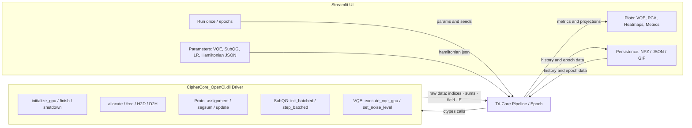

# Tri-Core Orchestrator **ULTRA**

**A (Proto/DL) + B (SubQG) + C (VQE)** – Interaktive GPU-Workbench für deinen `CipherCore_OpenCl`-Treiber

[](#)
[](#)
[](#)
[](#license)

Eine **lokal lauffähige Streamlit-Anwendung**, die drei Rechenpfade **sichtbar koppelt**:

- **A – Proto/DL:** GPU-Zuordnung ➜ segmentierte Aggregation ➜ Prototyp-Update  
- **B – SubQG:** myzelartige Feldsimulation (Batches) mit **Konfidenz-Metriken** (Mean/Std/Sigma)  
- **C – VQE:** Variational Quantum Eigensolver (SPSA) mit **frei editierbarem Pauli-Z-Hamiltonian**

Die Kopplung sorgt für **geschlossene Rückkopplungsschleifen**:

- **Feld-Score →** moduliert **Lernrate** (LR) der Prototyp-Updates  
- **VQE-Energie →** moduliert **Rauschpegel** im Treiber (`set_noise_level`)

> **Ziel:** Eine **reproduzierbare**, **performante** und **didaktisch klare** Experimentier- und Demo-Umgebung, die klassische Lernverfahren, feldbasierte Emergenz und quanteninspirierte Optimierung **in einem UI** erlebbar macht.

---

## Inhaltsverzeichnis

- [Features](#features)
- [Schnellstart](#schnellstart)
- [Voraussetzungen](#voraussetzungen)
- [Installation](#installation)
- [Starten](#starten)
- [Benutzung (UI-Leitfaden)](#benutzung-ui-leitfaden)
- [Architektur](#architektur)
- [Testumgebung & Validierung](#testumgebung--validierung)
- [Treiber-API (ctypes-Bindings)](#treiber-api-ctypes-bindings)
- [Parameter & Kopplung](#parameter--kopplung)
- [Exports & Formate](#exports--formate)
- [Benchmarks & Auto-GPU](#benchmarks--auto-gpu)
- [Troubleshooting](#troubleshooting)
- [FAQ](#faq)
- [Lizenz](#license)
- [Zitieren](#zitieren)

---

## Features

- **Tri-Core-Kopplung**: A (Proto/DL) ↔ B (SubQG) ↔ C (VQE) in einem konsistenten Ablauf pro Epoche  
- **VQE-Editor**: Hamiltonian als **JSON** (Pauli-Z-Terme: `{"z_mask": int, "c": float}`) – Validierung im UI  
- **Konfidenz-Heatmaps**: Mean/Std/Sigma aus mehreren SubQG-Samples pro Epoche  
- **PCA-Visualisierung**: Vorher/Nachher, Δ-Pfeile, **Trajektorien** einzelner Prototypen, **GIF-Export**  
- **Persistenz**: **.npz**-Sitzungen (History + Epoche-Daten + Parameter) laden/speichern  
- **Robustes UI**: Ein-Epoche-Fälle ohne Streamlit-Fehler (Slider-Fallbacks, Singleton-Plots)  
- **GPU-Werkzeuge**: GPU-Liste, Micro-Benchmark, **Auto-Auswahl** der schnellsten GPU  
- **Lokaler Datenschutz**: Keine Cloud, alles offline

---

## Schnellstart

```bash
# 1) Repo klonen und in den Ordner wechseln
git clone <DEIN_REPO.git>
cd <DEIN_REPO>

# 2) Virtuelle Umgebung (empfohlen)
python -m venv .venv
.venv\Scripts\activate

# 3) Abhängigkeiten
pip install -r requirements.txt

# 4) Streamlit App starten
streamlit run streamlit_tri_core_ultra.py
````

> **Hinweis (Windows-Pfad):** Lege die `CipherCore_OpenCl.dll` in deinen Projektordner oder trage den absoluten Pfad im **Sidebar-Feld „DLL-Pfad“** ein.
> **URL-Parameter:** Der **GPU-Index** wird in der URL gehalten (`?gpu=0`). Der **DLL-Pfad** bleibt **nur** im Session-State.

---

## Voraussetzungen

* **Python 3.12**
* **Windows 10/11**
* **GPU mit OpenCL** (AMD, ggf. weitere – abhängig vom Treiber)
* **Dein Treiber/DLL:** `CipherCore_OpenCl.dll`

**Python-Pakete (Kern):**

`streamlit`, `numpy`, `matplotlib`, `plotly`, `imageio`, `Pillow`, `pytest` (für Tests), optional `pytest-cov`

Beispiel-`requirements.txt`:

```txt
streamlit>=1.36
numpy>=2.0
matplotlib>=3.9
plotly>=5.22
imageio>=2.34
Pillow>=10.3
pytest>=8.2
pytest-cov>=5.0
```

---

## Starten

```bash
streamlit run streamlit_tri_core_ultra.py
```

* **Sidebar**: DLL-Pfad setzen, GPU-Index wählen/prüfen, VQE-/SubQG-/LR-Parameter einstellen
* **Run once**: startet **eine** Epoche
* **Run epochs**: führt mehrere Epochen sequentiell aus

---

## Benutzung (UI-Leitfaden)

### 1) Einstellungen (Sidebar)

* **DLL-Pfad**: stabil nur im Session-State (kein Query-Param, robust gegen Windows-Pfade)
* **GPU-Index**: Zahleneingabe; in der URL (`?gpu=N`) aktualisiert
* **GPU-Werkzeuge**:

  * **🧭 GPUs auflisten** – probiert Indizes durch & zeigt verfügbare Geräte
  * **📊 GPU-Benchmark** – Micro-Bench (Assignment + Segmented Sum)
  * **🏎️ Schnellste GPU wählen (Auto)** – misst Kandidaten & setzt besten Index
* **VQE/SPSA**: `Qubits`, `Layers`, `SPSA-Iterationen`
* **SubQG Konfidenz**: `Samples pro Epoche` (für Mean/Std/Sigma)
* **LR-Kopplung**: Modus (`exp`, `sigmoid`, `tanh`, `linear`) + Parameter
* **Hamiltonian (JSON)**: Pauli-Z-Terme editieren & validieren

### 2) Live-Ansicht (Main)

* **VQE-Plot**: Energie pro Iteration (SPSA-Verlauf)
* **Metriken**: Feld-Score, bestE, modulierte LR, gesetztes Noise, ΔProto-L2 gesamt
* **Zeitverlauf**: Linienplots für Feld-Score & ΔProto-L2 über Epochen
* **PCA-Bereich**:

  * Vorher/Nachher-Scatter + Δ-Linien
  * **Trajektorie eines Prototyps** über Epochen
  * **GIF-Export** der PCA-Zeitreihe
* **Heatmaps**:

  * Tabs: **Mean**, **Std**, **Sigma = |mean|/std**
  * **Historie-Raster** der letzten N Epochen (Mean)
* **Per-Proto-Metriken**:

  * Tabelle (sortierbar nach Δ-Embedding oder Δ-PCA)
  * Balkendiagramme je Epoche

### 3) Persistenz

* **💿 Speichern (.npz)** – komplette Sitzung inkl. Parameter
* **📥 Laden (.npz)** – rekonstruiert History, Epoche-Daten und UI-Parameter

---

## Architektur



**Ablauf pro Epoche (vereinfacht):**

1. **Assignment** (A1) → **Segmented Sum** (A2) → **Update** (A3, konstante LR)
2. **SubQG**-Batch-Samples → **Feld-Score** (mean) & **Std** → **LR-Modulation**
3. **VQE (SPSA)** → **bestE** → `set_noise_level()` im Treiber
4. **Zweites Update** (A4, modulierte LR)
5. **Metriken/Plots**: Δ-L2 gesamt, Per-Proto Δ(Embedding/PCA), PCA-Vorher/Nachher, Heatmaps, VQE-Kurve

---

## 🧪 Testumgebung & Validierung

Ziel: **Fehler früh finden**, Treiber/DLL **sicher** initialisieren, Datenpfade und Kopplungen **deterministisch** prüfen.

### Env-Variablen

* `CIPHERCORE_DLL` – Pfad zur `CipherCore_OpenCl.dll` (falls nicht im Projektordner)
* `CIPHERCORE_GPU` – gewünschter GPU-Index (Standard: `0`)

PowerShell-Beispiel:

```powershell
$env:CIPHERCORE_DLL="G:\Tri-Core-Orchestrator-ULTRA\build\CipherCore_OpenCl.dll"
$env:CIPHERCORE_GPU="0"
```

### Pytest ausführen

```bash
# komplette Suite (DLL + Orchestrator)
pytest -v

# nur die UI/Orchestrator-Tests
pytest -v tests/test_streamlit_tri_core_ultra.py

# mit kurzer Zusammenfassung
pytest -rs
```

**Beispiel-Ergebnis (Lokal):**

```
================================================= 14 passed in 17.9s ==================================================
```

### PowerShell-Runner

`tests/run_tests.ps1` (nutzt obige Env-Variablen, setzt sinnvolle Defaults):

```powershell
param(
  [string]$Dll = $env:CIPHERCORE_DLL,
  [int]$Gpu = [int]($env:CIPHERCORE_GPU | ForEach-Object { if ($_ -ne $null) { $_ } else { 0 } })
)

if (-not $Dll) { $Dll = (Join-Path $PSScriptRoot "..\build\CipherCore_OpenCl.dll") }
Write-Host "Using CIPHERCORE_DLL=$Dll"
Write-Host "Using CIPHERCORE_GPU=$Gpu"

$env:CIPHERCORE_DLL = $Dll
$env:CIPHERCORE_GPU = "$Gpu"

pytest -q tests/test_streamlit_tri_core_ultra.py
```

**Runner starten:**

```powershell
.\tests\run_tests.ps1
```

### Pytest-Konfiguration (optional)

`pytest.ini`:

```ini
[pytest]
addopts = -q
testpaths = tests, .
filterwarnings =
    ignore::DeprecationWarning
```

### Testmatrix (Auszug)

| Komponente                         | Ziel                                 | Test/Skript                              |
| ---------------------------------- | ------------------------------------ | ---------------------------------------- |
| DLL-Init & Kernel-Compile          | OpenCL-Kontext & Kernels ok          | `function_test.py::test_*`               |
| Elementweise Ops / MatMul / Adam   | numerische Korrektheit               | `function_test.py`                       |
| Quantum-Echo Varianten             | OTOC/Echo-Pfade korrekt              | `function_test.py`                       |
| LR-Modulation & Masken             | monotone Kopplung / Bounds           | `tests/test_streamlit_tri_core_ultra.py` |
| Assignment-Metriken                | Entropy/Coverage plausibel           | `tests/test_streamlit_tri_core_ultra.py` |
| VQE-Param-Zählung (Ansatz)         | Parameteranzahl vs. Gates konsistent | `tests/test_streamlit_tri_core_ultra.py` |
| Golden Snapshot / Export-Roundtrip | deterministischer Export/Import      | `tests/test_streamlit_tri_core_ultra.py` |

> **Hinweis:** Die App prüft beim Start zusätzlich die GPU-Initialisierung und meldet Fehler im UI.

---

## Treiber-API (ctypes-Bindings)

**Core / Memory / Sync**

* `initialize_gpu(gpu: int) -> int`
* `finish_gpu(gpu: int) -> int`
* `shutdown_gpu(gpu: int) -> None`
* `allocate_gpu_memory(gpu: int, size: size_t) -> void*`
* `free_gpu_memory(gpu: int, ptr: void*) -> None`
* `write_host_to_gpu_blocking(gpu: int, dst: void*, offset: size_t, nbytes: size_t, src: void*) -> int`
* `read_gpu_to_host_blocking(gpu: int, src: void*, offset: size_t, nbytes: size_t, dst: void*) -> int`

**A) Proto/DL**

* `execute_dynamic_token_assignment_gpu(...) -> int`
* `execute_proto_segmented_sum_gpu(...) -> int`
* `execute_proto_update_step_gpu(...) -> int`
* `execute_shape_loss_with_reward_penalty_list_gpu(...) -> int` *(optional)*

**B) SubQG**

* `subqg_initialize_state_batched(...) -> int`
* `subqg_simulation_step_batched(...) -> int`

**C) VQE**

* `execute_vqe_gpu(gpu, qubits, layers, theta*, theta_len, pauli_terms*, num_terms, out_E*, out_grad*) -> int`
  `PauliZTerm{ uint64 z_mask; float coefficient; }`
* `set_noise_level(gpu, noise: float) -> void`

Alle Calls werden intern über `_chk(ok, where)` abgesichert (Fehlerrückgabe ≠ 1 → Exception).

---

## Parameter & Kopplung

**Learning-Rate-Modi** (Python 3.12, strukturelles Pattern-Matching):

* `exp`: `lr = base * (0.5 + p2 * (1 - exp(-p1 * x)))`
* `sigmoid`: `lr = base * (0.5 + σ(p1*(x - p2)))`
* `tanh`: `lr = base * (0.5 + 0.5*(1 + tanh(p1*(x - p2))))`
* `linear`: `lr = base * (0.5 + p1 * x)`

Mit **Clamping**: `LR_MIN ≤ lr ≤ LR_MAX`.

**Kopplungen:**

* `field_score (mean_map.mean()) → lr_mod`
* `best_E (VQE) → noise := clip(SUBQG_NOISE * (1 + 0.25*best_E), 0..1) → set_noise_level()`

---

## Exports & Formate

### JSON-Export (kompakt)

```json
{
  "epoch": [1, 2, 3],
  "field_score_mean": [0.0039, 0.0041, 0.0040],
  "vqe_best_E": [0.052, 0.050, 0.049],
  "delta_proto_l2_total": [3.12, 3.04, 2.98],
  "noise_set": [0.062, 0.061, 0.061],
  "params": {
    "qubits": 10,
    "layers": 2,
    "spsa_iters": 60,
    "B": 2, "S": 8, "E": 32, "T": 16,
    "SUBQG_BATCH_CELLS": 64,
    "subqg_samples": 5,
    "lr_mode": "exp", "lr_p1": 1.0, "lr_p2": 1.0,
    "pauli_terms": "[{\"z_mask\":1,\"c\":1.0},{\"z_mask\":2,\"c\":1.0},{\"z_mask\":3,\"c\":1.0}]"
  }
}
```

### **.npz**-Sitzung (vollständig)

* `history_epoch`, `history_field_score`, `history_vqe_best_E`,
  `history_delta_proto`, `history_noise_set` (NumPy-Arrays)
* `epoch_data_json` – **Liste** je Epoche mit:

  * `pca_before (T,2)`, `pca_after (T,2)`
  * `field_map_mean`, `field_map_std (SUBQG_BATCH_CELLS,)`
  * `delta_per_proto_emb (T,)`, `delta_per_proto_pca (T,)`
* `params_json` – alle UI-Parameter (inkl. Hamiltonian)

### PCA-GIF

* Export der Prototyp-Trajektorie als **GIF** (fps & Breite konfigurierbar)

---

## Benchmarks & Auto-GPU

* **GPU-Benchmark**: mischt *Assignment* und *Segmented Sum* zu einem Mikro-Durchlauf und zeigt **ms** pro Gerät
* **Auto-Auswahl**: misst alle initialisierbaren GPUs, wählt **kleinste Laufzeit** und setzt `?gpu=<best>`

---

## Troubleshooting

**Slider-Fehler: *min_value must be less than max_value***
→ Tritt auf, wenn nur **eine** Epoche existiert. In dieser App sind **alle** Slider robust:

* Bei nur 1 Epoche wird der Slider deaktiviert und ein **Fixwert** genutzt (inkl. Hinweis).

**DLL lädt nicht / `Treiber-Call fehlgeschlagen`**

* Pfad prüfen (absolut/relativ), DLL-Abhängigkeiten (OpenCL-Runtime), Zugriffsrechte
* Prüfe, ob `initialize_gpu(gpu)` auf der gewählten GPU **1** zurückgibt (sonst anderen Index wählen)

**Leere/weiße Plots**

* Erst **Run once** starten – danach stehen alle Visualisierungen und Metriken zur Verfügung

**Hohe Speichernutzung nach vielen Epochen**

* Jede Epoche speichert PCA & Heatmaps. Für sehr lange Läufe: Sitzung gelegentlich **speichern & neu starten**

---

## FAQ

**Welche Hamiltonian-Terme sind erlaubt?**
Nur **Pauli-Z**-Terme (Z-Paare, -Tripel etc.) über `z_mask` (Bitmaske der Qubits) und `c` (Koeffizient). Beispiel:

```json
[
  {"z_mask": 1, "c": 1.0},   // Z0
  {"z_mask": 2, "c": 1.0},   // Z1
  {"z_mask": 3, "c": 1.0}    // Z0Z1
]
```

**Warum ist die LR begrenzt?**
Um Ausreißer im Feld-Score zu dämpfen und **stabile Updates** zu sichern (`LR_MIN`, `LR_MAX`).

**Wie werden PCA-Achsen bestimmt?**
Auf **concat(Vorher, Nachher)** pro Epoche – dadurch bleiben Achsen **vergleichbar** (kein Achsensprung).

**Was ist der Feld-Score?**
Mittelwert der **positiven** Zellen der mittleren Feldkarte (`mean_map`), dient als **Signalstärke** des SubQG-Feldes.

---

## License

MIT – siehe `LICENSE`.

---

## Zitieren

Wenn du die App/DLL in Veröffentlichungen erwähnst, freue ich mich über eine Referenz:

> R. Krümmel, *Tri-Core Orchestrator ULTRA – A (Proto/DL) + B (SubQG) + C (VQE)*, 2025.
> Streamlit-App und GPU-Treiber-Bindings für interaktive, lokal reproduzierbare Experimente.

---

### Anhang: Start-Command in Kurzform

```bash
streamlit run streamlit_tri_core_ultra.py
```
## 🛠️ Build-Prozess (Windows)

Dieser Abschnitt nutzt deine Skripte im Ordner **`driver_build/`**.

### Voraussetzungen

* Visual Studio 2022 Build Tools (C/C++), Windows 10/11 SDK
* OpenCL-Runtime (über GPU-Treiber)
* (Optional) CMake/Ninja für manuelle Builds

---

### A) One-Click-Build mit Skripten (empfohlen)

1. **Developer-Konsole öffnen**
   „x64 Native Tools Command Prompt for VS 2022“ **oder** PowerShell mit geladenem `VsDevCmd.bat`.

2. **Minimal-Build (schnell)**

   ```bat
   driver_build\build_driver_min.bat
   ```

   * Baut `build\CipherCore_OpenCl.dll` (Release)
   * Bindet Ressourcen über `driver_build\CipherCore_OpenCl.rc` ein

3. **Release-Build (Versionierung / Artefakte)**

   ```bat
   driver_build\release.bat
   ```

   * Erwartete Ausgaben:
     `build\CipherCore_OpenCl.dll`, `build\CipherCore_OpenCl.pdb`, `build\CipherCore_OpenCl.lib` (optional)

4. **Post-Build (Kopieren/Signieren/Packen)**

   ```bat
   driver_build\post_build.bat
   ```

   * Kopiert u. a. in `dist\` bzw. App-Verzeichnis, optional Codesign/Zip

5. **Exports prüfen**

   ```powershell
   .\driver_build\exports_list.ps1
   ```

   * Generiert eine Exportliste (z. B. `dist\exports.txt`) via `dumpbin`/`llvm-objdump`

**Erwartung:**
Deine aktuelle DLL exportiert **94 Funktionen** (z. B. `initialize_gpu`, `execute_vqe_gpu`, `set_noise_level`, `execute_proto_*`, `subqg_*`, …).
Der von dir gepostete Lauf zeigt **Name Pointer/Ordinal Table = 94 Einträge** sowie eine **Import-Tabelle** u. a. für `OpenCL.dll`, `KERNEL32.dll`, `msvcrt.dll`.

> 🔎 **Hinweis zu „xdata section corrupt“:**
> Diese Warnungen entstehen häufig, wenn Tools Unwind/XDATA unterschiedlich interpretieren (insb. bei LTO, Inlining oder `/guard:cf`).
> Mit `dumpbin /UNWINDINFO` in der VS-Entwicklerkonsole bekommst du eine stabilere Sicht.
> Solange **Export/Import** und **Runtime-Tests** passen, sind die Meldungen unkritisch.

---

## 🧪 Testumgebung & Validierung

Die Tests liegen in **`tests/`**, die Build-Hilfen in **`driver_build/`**.
Für GPU-gebundene Checks setzt du **ENV-Variablen** (DLL-Pfad & GPU-Index):

### A) Quick-Smoke

```powershell
# Pfade anpassen, falls nötig
$env:CIPHERCORE_DLL = "$PWD\build\CipherCore_OpenCl.dll"
$env:CIPHERCORE_GPU = "0"

# optional: Exporte listen
.\driver_build\exports_list.ps1

# schneller Funktionstest (Python)
python .\function_test.py
```

### B) Vollsuite (pytest)

```powershell
# Virtuelle Umgebung aktivieren
.\.venv\Scripts\activate

# Komplett (inkl. Streamlit-spezifischer Tests)
pytest -v
# oder mit Kurzbericht:
pytest -rs
```

**Beispiel-Ergebnis (dein letzter Lauf):**

```
(.venv) PS G:\Tri-Core-Orchestrator-ULTRA> pytest -v
================================================= test session starts =================================================
platform win32 -- Python 3.12.10, pytest-8.4.2, pluggy-1.6.0 -- G:\Tri-Core-Orchestrator-ULTRA\.venv\Scripts\python.exe
cachedir: .pytest_cache
rootdir: G:\Tri-Core-Orchestrator-ULTRA
configfile: pytest.ini
testpaths: tests,, .
collected 14 items

function_test.py::test_elementwise_ops PASSED                                                                    [  7%]
function_test.py::test_matmul_and_transpose PASSED                                                               [ 14%]
function_test.py::test_activation_ops PASSED                                                                     [ 21%]
function_test.py::test_adam PASSED                                                                               [ 28%]
function_test.py::test_embedding PASSED                                                                          [ 35%]
function_test.py::test_quantum_echo PASSED                                                                       [ 42%]
function_test.py::test_quantum_echo_without_v PASSED                                                             [ 50%]
function_test.py::test_quantum_echo_random PASSED                                                                [ 57%]
tests/test_streamlit_tri_core_ultra.py::test_lr_modulated_mix_component PASSED                                   [ 64%]
tests/test_streamlit_tri_core_ultra.py::test_proto_lr_mask_monotonic PASSED                                      [ 71%]
tests/test_streamlit_tri_core_ultra.py::test_assignment_metrics_entropy_and_coverage PASSED                      [ 78%]
tests/test_streamlit_tri_core_ultra.py::test_num_params_for_ansatz_gate_awareness PASSED                         [ 85%]
tests/test_streamlit_tri_core_ultra.py::test_golden_snapshot_matches_fixture PASSED                              [ 92%]
tests/test_streamlit_tri_core_ultra.py::test_build_export_payload_roundtrip PASSED                               [100%]

================================================= 14 passed in 18.36s =================================================
(.venv) PS G:\Tri-Core-Orchestrator-ULTRA>
```
```
(.venv) PS G:\Tri-Core-Orchestrator-ULTRA> pytest -rs
================================================= test session starts =================================================
platform win32 -- Python 3.12.10, pytest-8.4.2, pluggy-1.6.0
rootdir: G:\Tri-Core-Orchestrator-ULTRA
configfile: pytest.ini
testpaths: tests,, .
collected 14 items

function_test.py ........                                                                                        [ 57%]
tests\test_streamlit_tri_core_ultra.py ......                                                                    [100%]

================================================= 14 passed in 18.23s =================================================
(.venv) PS G:\Tri-Core-Orchestrator-ULTRA>
```
```
(.venv) PS G:\Tri-Core-Orchestrator-ULTRA> .\tests\run_tests.ps1
Using CIPHERCORE_DLL=G:\Tri-Core-Orchestrator-ULTRA\build\CipherCore_OpenCl.dll
Using CIPHERCORE_GPU=0
================================================= test session starts =================================================
platform win32 -- Python 3.12.10, pytest-8.4.2, pluggy-1.6.0
rootdir: G:\Tri-Core-Orchestrator-ULTRA
configfile: pytest.ini
collected 6 items

tests\test_streamlit_tri_core_ultra.py ......                                                                    [100%]

================================================== 6 passed in 0.06s ==================================================
(.venv) PS G:\Tri-Core-Orchestrator-ULTRA>
```
```
(.venv) PS G:\Tri-Core-Orchestrator-ULTRA> .\driver_build\exports_list.ps1
[INFO] DLL: G:\Tri-Core-Orchestrator-ULTRA\build\CipherCore_OpenCl.dll

.\build\CipherCore_OpenCl.dll:     file format pei-x86-64

Characteristics 0x2026
        executable
        line numbers stripped
        large address aware
        DLL

Time/Date               Sat Nov 01 20:31:46 2025
Magic                   020b    (PE32+)
MajorLinkerVersion      2
MinorLinkerVersion      36
SizeOfCode              000000000003b800
SizeOfInitializedData   0000000000062600
SizeOfUninitializedData 0000000000001800
AddressOfEntryPoint     0000000000001350
BaseOfCode              0000000000001000
ImageBase               00000001db600000
SectionAlignment        00001000
FileAlignment           00000200
MajorOSystemVersion     4
MinorOSystemVersion     0
MajorImageVersion       0
MinorImageVersion       0
MajorSubsystemVersion   5
MinorSubsystemVersion   2
Win32Version            00000000
SizeOfImage             000d2000
SizeOfHeaders           00000600
CheckSum                000df953
Subsystem               00000003        (Windows CUI)
DllCharacteristics      00000160
SizeOfStackReserve      0000000000200000
SizeOfStackCommit       0000000000001000
SizeOfHeapReserve       0000000000100000
SizeOfHeapCommit        0000000000001000
LoaderFlags             00000000
NumberOfRvaAndSizes     00000010

The Data Directory
Entry 0 0000000000065000 00000d07 Export Directory [.edata (or where ever we found it)]
Entry 1 0000000000066000 00000ce4 Import Directory [parts of .idata]
Entry 2 0000000000069000 00000358 Resource Directory [.rsrc]
Entry 3 0000000000061000 00000cd8 Exception Directory [.pdata]
Entry 4 0000000000000000 00000000 Security Directory
Entry 5 000000000006a000 0000015c Base Relocation Directory [.reloc]
Entry 6 0000000000000000 00000000 Debug Directory
Entry 7 0000000000000000 00000000 Description Directory
Entry 8 0000000000000000 00000000 Special Directory
Entry 9 000000000005f220 00000028 Thread Storage Directory [.tls]
Entry a 0000000000000000 00000000 Load Configuration Directory
Entry b 0000000000000000 00000000 Bound Import Directory
Entry c 0000000000066328 000002d8 Import Address Table Directory
Entry d 0000000000000000 00000000 Delay Import Directory
Entry e 0000000000000000 00000000 CLR Runtime Header
Entry f 0000000000000000 00000000 Reserved

There is an import table in .idata at 0xdb666000

The Import Tables (interpreted .idata section contents)
 vma:            Hint    Time      Forward  DLL       First
                 Table   Stamp     Chain    Name      Thunk
 00066000       00066050 00000000 00000000 00066bcc 00066328

        DLL Name: OpenCL.dll
        vma:  Hint/Ord Member-Name Bound-To
        66600       0  clBuildProgram
        66612       3  clCreateBuffer
        66624       5  clCreateCommandQueue
        6663c       7  clCreateContext
        6664e      18  clCreateKernel
        66660      24  clCreateProgramWithSource
        6667c      33  clEnqueueCopyBuffer
        66692      38  clEnqueueFillBuffer
        666a8      40  clEnqueueMapBuffer
        666be      45  clEnqueueNDRangeKernel
        666d8      47  clEnqueueReadBuffer
        666ee      58  clEnqueueUnmapMemObject
        66708      60  clEnqueueWriteBuffer
        66720      63  clFinish
        6672c      68  clGetDeviceIDs
        6673e      69  clGetDeviceInfo
        66750      71  clGetEventProfilingInfo
        6676a      84  clGetPlatformIDs
        6677e      85  clGetPlatformInfo
        66792      86  clGetProgramBuildInfo
        667aa      91  clReleaseCommandQueue
        667c2      92  clReleaseContext
        667d6      94  clReleaseEvent
        667e8      95  clReleaseKernel
        667fa      96  clReleaseMemObject
        66810      97  clReleaseProgram
        66824     113  clSetKernelArg
        66836     122  clWaitForEvents

 00066014       00066138 00000000 00000000 00066c10 00066410

        DLL Name: KERNEL32.dll
        vma:  Hint/Ord Member-Name Bound-To
        66848     283  DeleteCriticalSection
        66860     319  EnterCriticalSection
        66878     630  GetLastError
        66888     892  InitializeCriticalSection
        668a4     919  IsDBCSLeadByteEx
        668b8     984  LeaveCriticalSection
        668d0    1036  MultiByteToWideChar
        668e6    1131  QueryPerformanceCounter
        66900    1132  QueryPerformanceFrequency
        6691c    1410  Sleep
        66924    1445  TlsGetValue
        66932    1492  VirtualProtect
        66944    1494  VirtualQuery
        66954    1547  WideCharToMultiByte

 00066028       000661b0 00000000 00000000 00066cd8 00066488

        DLL Name: msvcrt.dll
        vma:  Hint/Ord Member-Name Bound-To
        6696a      64  ___lc_codepage_func
        66980      67  ___mb_cur_max_func
        66996      84  __iob_func
        669a4     100  __setusermatherr
        669b8     124  _amsg_exit
        669c6     203  _errno
        669d0     331  _initterm
        669dc     443  _lock
        669e4     752  _strnicmp
        669f0     819  _unlock
        669fa    1038  abort
        66a02    1049  atoi
        66a0a    1055  calloc
        66a14    1072  fclose
        66a1e    1078  fgets
        66a26    1085  fopen
        66a2e    1090  fputc
        66a36    1094  fread
        66a3e    1095  free
        66a46    1109  fwrite
        66a50    1112  getc
        66a58    1127  islower
        66a62    1130  isspace
        66a6c    1131  isupper
        66a76    1145  isxdigit
        66a82    1149  localeconv
        66a90    1156  malloc
        66a9a    1164  memcpy
        66aa4    1166  memset
        66aae    1184  rand
        66ab6    1185  realloc
        66ac0    1211  strchr
        66aca    1212  strcmp
        66ad4    1217  strerror
        66ae0    1219  strlen
        66aea    1222  strncmp
        66af4    1223  strncpy
        66afe    1228  strstr
        66b08    1231  strtok
        66b12    1233  strtol
        66b1c    1234  strtoul
        66b26    1251  tolower
        66b30    1252  toupper
        66b3a    1255  ungetc
        66b44    1258  vfprintf
        66b50    1283  wcslen

 0006603c       00000000 00000000 00000000 00000000 00000000

There is an export table in .edata at 0xdb665000

The Export Tables (interpreted .edata section contents)

Export Flags                    0
Time/Date stamp                 69066022
Major/Minor                     0/0
Name                            00000000000653d4 CipherCore_OpenCl.dll
Ordinal Base                    1
Number in:
        Export Address Table            0000005e
        [Name Pointer/Ordinal] Table    0000005e
Table Addresses
        Export Address Table            0000000000065028
        Name Pointer Table              00000000000651a0
        Ordinal Table                   0000000000065318

Export Address Table -- Ordinal Base 1
        [   0] +base[   1] c590 Export RVA
        [   1] +base[   2] 2b340 Export RVA
        [   2] +base[   3] 2a980 Export RVA
        [   3] +base[   4] 2c9e0 Export RVA
        [   4] +base[   5] 2a8a0 Export RVA
        [   5] +base[   6] 2bf50 Export RVA
        [   6] +base[   7] 2ac50 Export RVA
        [   7] +base[   8] 2c8b0 Export RVA
        [   8] +base[   9] 2cde0 Export RVA
        [   9] +base[  10] 2bac0 Export RVA
        [  10] +base[  11] 2b930 Export RVA
        [  11] +base[  12] 2adc0 Export RVA
        [  12] +base[  13] 2a7d0 Export RVA
        [  13] +base[  14] 14ce0 Export RVA
        [  14] +base[  15] 2cb30 Export RVA
        [  15] +base[  16] 19be0 Export RVA
        [  16] +base[  17] 2b220 Export RVA
        [  17] +base[  18] 2ab40 Export RVA
        [  18] +base[  19] 2c7c0 Export RVA
        [  19] +base[  20] 2aea0 Export RVA
        [  20] +base[  21] 2c4b0 Export RVA
        [  21] +base[  22] 2c320 Export RVA
        [  22] +base[  23] 2a550 Export RVA
        [  23] +base[  24] 2b740 Export RVA
        [  24] +base[  25] 2aa60 Export RVA
        [  25] +base[  26] 2cf70 Export RVA
        [  26] +base[  27] 2d080 Export RVA
        [  27] +base[  28] 2d240 Export RVA
        [  28] +base[  29] 15e20 Export RVA
        [  29] +base[  30] 1bb10 Export RVA
        [  30] +base[  31] 176b0 Export RVA
        [  31] +base[  32] 299d0 Export RVA
        [  32] +base[  33] 2be40 Export RVA
        [  33] +base[  34] 2d3f0 Export RVA
        [  34] +base[  35] 2d5a0 Export RVA
        [  35] +base[  36] 1ca90 Export RVA
        [  36] +base[  37] 2b650 Export RVA
        [  37] +base[  38] 2a6e0 Export RVA
        [  38] +base[  39] 2cd10 Export RVA
        [  39] +base[  40] 2c1d0 Export RVA
        [  40] +base[  41] 2b850 Export RVA
        [  41] +base[  42] 2c0a0 Export RVA
        [  42] +base[  43] 2ace0 Export RVA
        [  43] +base[  44] 19250 Export RVA
        [  44] +base[  45] 2a450 Export RVA
        [  45] +base[  46] c6c0 Export RVA
        [  46] +base[  47] 2d7e0 Export RVA
        [  47] +base[  48] 84d0 Export RVA
        [  48] +base[  49] 2d7a0 Export RVA
        [  49] +base[  50] a2d0 Export RVA
        [  50] +base[  51] 127b0 Export RVA
        [  51] +base[  52] 181c0 Export RVA
        [  52] +base[  53] 12df0 Export RVA
        [  53] +base[  54] 13420 Export RVA
        [  54] +base[  55] 12c10 Export RVA
        [  55] +base[  56] 123e0 Export RVA
        [  56] +base[  57] c920 Export RVA
        [  57] +base[  58] 12300 Export RVA
        [  58] +base[  59] 11fb0 Export RVA
        [  59] +base[  60] 12370 Export RVA
        [  60] +base[  61] 2d7b0 Export RVA
        [  61] +base[  62] 2d7c0 Export RVA
        [  62] +base[  63] 12450 Export RVA
        [  63] +base[  64] f3a0 Export RVA
        [  64] +base[  65] f810 Export RVA
        [  65] +base[  66] f770 Export RVA
        [  66] +base[  67] 2d790 Export RVA
        [  67] +base[  68] f8b0 Export RVA
        [  68] +base[  69] f2c0 Export RVA
        [  69] +base[  70] 148c0 Export RVA
        [  70] +base[  71] 2d910 Export RVA
        [  71] +base[  72] 2d850 Export RVA
        [  72] +base[  73] 2d8b0 Export RVA
        [  73] +base[  74] 2d8d0 Export RVA
        [  74] +base[  75] 108f0 Export RVA
        [  75] +base[  76] fe00 Export RVA
        [  76] +base[  77] faf0 Export RVA
        [  77] +base[  78] f950 Export RVA
        [  78] +base[  79] 11950 Export RVA
        [  79] +base[  80] 10e30 Export RVA
        [  80] +base[  81] 11560 Export RVA
        [  81] +base[  82] e7d0 Export RVA
        [  82] +base[  83] cac0 Export RVA
        [  83] +base[  84] cb70 Export RVA
        [  84] +base[  85] e300 Export RVA
        [  85] +base[  86] eb30 Export RVA
        [  86] +base[  87] 12bf0 Export RVA
        [  87] +base[  88] e850 Export RVA
        [  88] +base[  89] 12ba0 Export RVA
        [  89] +base[  90] f260 Export RVA
        [  90] +base[  91] f200 Export RVA
        [  91] +base[  92] cc40 Export RVA
        [  92] +base[  93] e1e0 Export RVA
        [  93] +base[  94] c780 Export RVA

[Ordinal/Name Pointer] Table
        [   0] allocate_gpu_memory
        [   1] execute_adam_update_on_gpu
        [   2] execute_add_bias_on_gpu
        [   3] execute_add_broadcast_pe_gpu
        [   4] execute_add_on_gpu
        [   5] execute_broadcast_add_gpu
        [   6] execute_clone_on_gpu
        [   7] execute_cross_entropy_loss_grad_gpu
        [   8] execute_dynamic_token_assignment_gpu
        [   9] execute_embedding_backward_gpu
        [  10] execute_embedding_lookup_gpu
        [  11] execute_gelu_backward_on_gpu
        [  12] execute_gelu_on_gpu
        [  13] execute_grover_gpu
        [  14] execute_hebbian_update_on_gpu
        [  15] execute_hhl_gpu
        [  16] execute_layernorm_backward_on_gpu
        [  17] execute_layernorm_on_gpu
        [  18] execute_log_softmax_stable_gpu
        [  19] execute_matmul_backward_on_gpu
        [  20] execute_matmul_batched_backward_on_gpu
        [  21] execute_matmul_batched_on_gpu
        [  22] execute_matmul_on_gpu
        [  23] execute_mul_backward_on_gpu
        [  24] execute_mul_on_gpu
        [  25] execute_pairwise_similarity_gpu
        [  26] execute_proto_segmented_sum_gpu
        [  27] execute_proto_update_step_gpu
        [  28] execute_qaoa_gpu
        [  29] execute_qec_cycle_gpu
        [  30] execute_qml_classifier_gpu
        [  31] execute_quantum_echoes_otoc_gpu
        [  32] execute_reduce_sum_gpu
        [  33] execute_shape_loss_with_reward_penalty_gpu
        [  34] execute_shape_loss_with_reward_penalty_list_gpu
        [  35] execute_shor_gpu
        [  36] execute_softmax_backward_on_gpu
        [  37] execute_softmax_on_gpu
        [  38] execute_threshold_spike_on_gpu
        [  39] execute_transpose_12_batched_gpu
        [  40] execute_transpose_backward_on_gpu
        [  41] execute_transpose_batched_gpu
        [  42] execute_transpose_on_gpu
        [  43] execute_vqe_gpu
        [  44] finish_gpu
        [  45] free_gpu_memory
        [  46] get_last_kernel_metrics
        [  47] get_last_quantum_echo_profile
        [  48] get_noise_level
        [  49] initialize_gpu
        [  50] load_mycel_state
        [  51] quantum_apply_gate_sequence
        [  52] quantum_export_to_qasm
        [  53] quantum_import_from_qasm
        [  54] quantum_upload_gate_sequence
        [  55] read_colonies
        [  56] read_gpu_to_host_blocking
        [  57] read_nutrient
        [  58] read_pheromone_slice
        [  59] read_potential
        [  60] register_kernel_measurement_buffers
        [  61] reset_kernel_measurement_buffers
        [  62] save_mycel_state
        [  63] set_diffusion_params
        [  64] set_mood_state
        [  65] set_neighbors_sparse
        [  66] set_noise_level
        [  67] set_nutrient_state
        [  68] set_pheromone_gains
        [  69] shutdown_gpu
        [  70] simulated_get_compute_unit_count
        [  71] simulated_kernel_allocate
        [  72] simulated_kernel_free
        [  73] simulated_kernel_write
        [  74] step_colony_update
        [  75] step_mycel_update
        [  76] step_pheromone_diffuse_decay
        [  77] step_pheromone_reinforce
        [  78] step_potential_for_hpio
        [  79] step_reproduction
        [  80] step_subqg_feedback
        [  81] subqg_init_mycel
        [  82] subqg_initialize_state
        [  83] subqg_initialize_state_batched
        [  84] subqg_inject_agents
        [  85] subqg_realloc_pheromone_channels
        [  86] subqg_release_state
        [  87] subqg_set_active_T
        [  88] subqg_set_deterministic_mode
        [  89] subqg_set_nutrient_recovery
        [  90] subqg_set_repro_params
        [  91] subqg_simulation_step
        [  92] subqg_simulation_step_batched
        [  93] write_host_to_gpu_blocking

The Function Table (interpreted .pdata section contents)
vma:                    BeginAddress     EndAddress       UnwindData
 00000001db661000:      00000001db601000 00000001db60100c 00000001db662000
 00000001db66100c:      00000001db601010 00000001db6011ff 00000001db662004
 00000001db661018:      00000001db601200 00000001db601344 00000001db662018
 00000001db661024:      00000001db601350 00000001db601362 00000001db662028
 00000001db661030:      00000001db601370 00000001db60137f 00000001db66202c
 00000001db66103c:      00000001db601380 00000001db60138c 00000001db662030
 00000001db661048:      00000001db601390 00000001db601391 00000001db662034
 00000001db661054:      00000001db6013a0 00000001db6013de 00000001db662038
 00000001db661060:      00000001db6013e0 00000001db60158e 00000001db662040
 00000001db66106c:      00000001db601590 00000001db6015bd 00000001db662048
 00000001db661078:      00000001db6015c0 00000001db60178d 00000001db662050
 00000001db661084:      00000001db601790 00000001db601848 00000001db662068
 00000001db661090:      00000001db601850 00000001db601cc7 00000001db662070
 00000001db66109c:      00000001db601cd0 00000001db601d5f 00000001db662088
 00000001db6610a8:      00000001db601d60 00000001db601e41 00000001db662094
 00000001db6610b4:      00000001db601e50 00000001db601ef4 00000001db66209c
 00000001db6610c0:      00000001db601f00 00000001db602022 00000001db6620a8
 00000001db6610cc:      00000001db602030 00000001db602152 00000001db6620b4
 00000001db6610d8:      00000001db602160 00000001db6023da 00000001db6620c0
 00000001db6610e4:      00000001db6023e0 00000001db60272d 00000001db6620d0
 00000001db6610f0:      00000001db602730 00000001db602cb9 00000001db6620ec
 00000001db6610fc:      00000001db602cc0 00000001db603401 00000001db662104
 00000001db661108:      00000001db603410 00000001db60365e 00000001db66211c
 00000001db661114:      00000001db603660 00000001db60399c 00000001db662128
 00000001db661120:      00000001db6039a0 00000001db603cec 00000001db662134
 00000001db66112c:      00000001db603cf0 00000001db60408c 00000001db662140
 00000001db661138:      00000001db604090 00000001db60443c 00000001db662154
 00000001db661144:      00000001db604440 00000001db60496e 00000001db662170
 00000001db661150:      00000001db604970 00000001db604c3c 00000001db662184
 00000001db66115c:      00000001db604c40 00000001db604de0 00000001db662190
 00000001db661168:      00000001db604de0 00000001db60597c 00000001db6621b4
 00000001db661174:      00000001db605980 00000001db605ffb 00000001db6621d0
 00000001db661180:      00000001db606000 00000001db606291 00000001db6621ec
 00000001db66118c:      00000001db6062a0 00000001db6063bd 00000001db662200
 00000001db661198:      00000001db6063c0 00000001db606d8e 00000001db66220c
 00000001db6611a4:      00000001db606d90 00000001db608440 00000001db662228
 00000001db6611b0:      00000001db608440 00000001db608448 00000001db662240
 00000001db6611bc:      00000001db608450 00000001db608456 00000001db662244
 00000001db6611c8:      00000001db608460 00000001db608463 00000001db662248
 00000001db6611d4:      00000001db608470 00000001db6084c2 00000001db66224c
 00000001db6611e0:      00000001db6084d0 00000001db608523 00000001db662254
 00000001db6611ec:      00000001db608530 00000001db6089ea 00000001db662258
 00000001db6611f8:      00000001db6089f0 00000001db608a56 00000001db66226c
 00000001db661204:      00000001db608a60 00000001db60a1fb 00000001db66227c
 00000001db661210:      00000001db60a200 00000001db60a2c2 00000001db66228c
 00000001db66121c:      00000001db60a2d0 00000001db60c589 00000001db662298
 00000001db661228:      00000001db60c590 00000001db60c6bf 00000001db6622b4
 00000001db661234:      00000001db60c6c0 00000001db60c774 00000001db6622c0
 00000001db661240:      00000001db60c780 00000001db60c911 00000001db6622cc
 00000001db66124c:      00000001db60c920 00000001db60cab1 00000001db6622dc
 00000001db661258:      00000001db60cac0 00000001db60cb6e 00000001db6622ec
 00000001db661264:      00000001db60cb70 00000001db60cc3c 00000001db6622f4
 00000001db661270:      00000001db60cc40 00000001db60e1d2 00000001db6622fc
 00000001db66127c:      00000001db60e1e0 00000001db60e2f7 00000001db662320
 00000001db661288:      00000001db60e300 00000001db60e7cf 00000001db662330
 00000001db661294:      00000001db60e7d0 00000001db60e84e 00000001db662340
 00000001db6612a0:      00000001db60e850 00000001db60eb28 00000001db66234c
 00000001db6612ac:      00000001db60eb30 00000001db60f1fa 00000001db662358
 00000001db6612b8:      00000001db60f200 00000001db60f251 00000001db662370
 00000001db6612c4:      00000001db60f260 00000001db60f2b1 00000001db662378
 00000001db6612d0:      00000001db60f2c0 00000001db60f393 00000001db662380
 00000001db6612dc:      00000001db60f3a0 00000001db60f76d 00000001db66238c
 00000001db6612e8:      00000001db60f770 00000001db60f801 00000001db662394
 00000001db6612f4:      00000001db60f810 00000001db60f8a1 00000001db66239c
 00000001db661300:      00000001db60f8b0 00000001db60f941 00000001db6623a4
 00000001db66130c:      00000001db60f950 00000001db60faee 00000001db6623ac
 00000001db661318:      00000001db60faf0 00000001db60fdf3 00000001db6623b8
 00000001db661324:      00000001db60fe00 00000001db6108e2 00000001db6623d4
 00000001db661330:      00000001db6108f0 00000001db610e26 00000001db662408
 00000001db66133c:      00000001db610e30 00000001db61155b 00000001db662424
 00000001db661348:      00000001db611560 00000001db611949 00000001db662464
 00000001db661354:      00000001db611950 00000001db611faf 00000001db662480
 00000001db661360:      00000001db611fb0 00000001db6122fb 00000001db6624bc
 00000001db66136c:      00000001db612300 00000001db612361 00000001db6624c4
 00000001db661378:      00000001db612370 00000001db6123d1 00000001db6624cc
 00000001db661384:      00000001db6123e0 00000001db612441 00000001db6624d4
 00000001db661390:      00000001db612450 00000001db6127a9 00000001db6624dc
 00000001db66139c:      00000001db6127b0 00000001db612b99 00000001db6624ec
 00000001db6613a8:      00000001db612ba0 00000001db612bee 00000001db6624fc
 00000001db6613b4:      00000001db612bf0 00000001db612c01 00000001db662500
 00000001db6613c0:      00000001db612c10 00000001db612de6 00000001db662504
 00000001db6613cc:      00000001db612df0 00000001db613415 00000001db662510
 00000001db6613d8:      00000001db613420 00000001db6148ba 00000001db662528
 00000001db6613e4:      00000001db6148c0 00000001db6148dc 00000001db66254c
 00000001db6613f0:      00000001db6148e0 00000001db614a17 00000001db662554
 00000001db6613fc:      00000001db614a20 00000001db614b51 00000001db662564
 00000001db661408:      00000001db614b60 00000001db614cd8 00000001db662570
 00000001db661414:      00000001db614ce0 00000001db615e14 00000001db662580
 00000001db661420:      00000001db615e20 00000001db6176a7 00000001db662598
 00000001db66142c:      00000001db6176b0 00000001db6181b3 00000001db6625c0
 00000001db661438:      00000001db6181c0 00000001db618d8c 00000001db6625ec
 00000001db661444:      00000001db618d90 00000001db61924d 00000001db662614
 00000001db661450:      00000001db619250 00000001db619bd7 00000001db662640
 00000001db66145c:      00000001db619be0 00000001db61bb0e 00000001db662668
 00000001db661468:      00000001db61bb10 00000001db61ca8d 00000001db662688
 00000001db661474:      00000001db61ca90 00000001db61e74c 00000001db6626b0
 00000001db661480:      00000001db61e750 00000001db6298af 00000001db6626d8
 00000001db66148c:      00000001db6298b0 00000001db6299c8 00000001db6626fc
 00000001db661498:      00000001db6299d0 00000001db62a444 00000001db662708
 00000001db6614a4:      00000001db62a450 00000001db62a54d 00000001db66272c
 00000001db6614b0:      00000001db62a550 00000001db62a6da 00000001db662738
 00000001db6614bc:      00000001db62a6e0 00000001db62a7ca 00000001db662744
 00000001db6614c8:      00000001db62a7d0 00000001db62a895 00000001db66274c
 00000001db6614d4:      00000001db62a8a0 00000001db62a975 00000001db662754
 00000001db6614e0:      00000001db62a980 00000001db62aa59 00000001db66275c
 00000001db6614ec:      00000001db62aa60 00000001db62ab35 00000001db662768
 00000001db6614f8:      00000001db62ab40 00000001db62ac43 00000001db662770
 00000001db661504:      00000001db62ac50 00000001db62acd1 00000001db66277c
 00000001db661510:      00000001db62ace0 00000001db62adb9 00000001db662784
 00000001db66151c:      00000001db62adc0 00000001db62ae95 00000001db662790
 00000001db661528:      00000001db62aea0 00000001db62b217 00000001db662798
 00000001db661534:      00000001db62b220 00000001db62b332 00000001db6627a8
 00000001db661540:      00000001db62b340 00000001db62b641 00000001db6627b0
 00000001db66154c:      00000001db62b650 00000001db62b732 00000001db6627c0
 00000001db661558:      00000001db62b740 00000001db62b850 00000001db6627c8
 00000001db661564:      00000001db62b850 00000001db62b929 00000001db6627d0
 00000001db661570:      00000001db62b930 00000001db62bab2 00000001db6627dc
 00000001db66157c:      00000001db62bac0 00000001db62be3f 00000001db6627e4
 00000001db661588:      00000001db62be40 00000001db62bf4e 00000001db6627f8
 00000001db661594:      00000001db62bf50 00000001db62c091 00000001db662804
 00000001db6615a0:      00000001db62c0a0 00000001db62c1c8 00000001db662810
 00000001db6615ac:      00000001db62c1d0 00000001db62c314 00000001db66281c
 00000001db6615b8:      00000001db62c320 00000001db62c4aa 00000001db66282c
 00000001db6615c4:      00000001db62c4b0 00000001db62c7b2 00000001db662838
 00000001db6615d0:      00000001db62c7c0 00000001db62c8aa 00000001db662850
 00000001db6615dc:      00000001db62c8b0 00000001db62c9d1 00000001db662858
 00000001db6615e8:      00000001db62c9e0 00000001db62cb21 00000001db662860
 00000001db6615f4:      00000001db62cb30 00000001db62cd01 00000001db66286c
 00000001db661600:      00000001db62cd10 00000001db62cdd5 00000001db662874
 00000001db66160c:      00000001db62cde0 00000001db62cf62 00000001db66287c
 00000001db661618:      00000001db62cf70 00000001db62d076 00000001db662884
 00000001db661624:      00000001db62d080 00000001db62d232 00000001db66288c
 00000001db661630:      00000001db62d240 00000001db62d3e9 00000001db662894
 00000001db66163c:      00000001db62d3f0 00000001db62d591 00000001db6628a0
 00000001db661648:      00000001db62d5a0 00000001db62d781 00000001db6628a8
 00000001db661654:      00000001db62d790 00000001db62d799 00000001db6628b0
 00000001db661660:      00000001db62d7a0 00000001db62d7a5 00000001db6628b4
 00000001db66166c:      00000001db62d7b0 00000001db62d7bf 00000001db6628b8
 00000001db661678:      00000001db62d7c0 00000001db62d7d7 00000001db6628bc
 00000001db661684:      00000001db62d7e0 00000001db62d843 00000001db6628c0
 00000001db661690:      00000001db62d850 00000001db62d8ac 00000001db6628c4
 00000001db66169c:      00000001db62d8b0 00000001db62d8c5 00000001db6628cc
 00000001db6616a8:      00000001db62d8d0 00000001db62d901 00000001db6628d0
 00000001db6616b4:      00000001db62d910 00000001db62d916 00000001db6628d4
 00000001db6616c0:      00000001db62d920 00000001db62d9a0 00000001db6628fc
 00000001db6616cc:      00000001db62d9a0 00000001db62d9b9 00000001db662900
 00000001db6616d8:      00000001db62d9c0 00000001db62d9c9 00000001db662904
 00000001db6616e4:      00000001db62d9d0 00000001db62d9db 00000001db662908
 00000001db6616f0:      00000001db62d9e0 00000001db62da93 00000001db66290c
 00000001db6616fc:      00000001db62db80 00000001db62dbba 00000001db662910
 00000001db661708:      00000001db62dbc0 00000001db62dc2a 00000001db662918
 00000001db661714:      00000001db62dc30 00000001db62dc4f 00000001db662924
 00000001db661720:      00000001db62dc50 00000001db62dc7f 00000001db662928
 00000001db66172c:      00000001db62dc80 00000001db62dd01 00000001db662930
 00000001db661738:      00000001db62dd10 00000001db62dd13 00000001db66293c
 00000001db661744:      00000001db62dd20 00000001db62dd8a 00000001db662940
 00000001db661750:      00000001db62dd90 00000001db62def2 00000001db66294c
 00000001db66175c:      00000001db62df00 00000001db62e17e 00000001db662958
 00000001db661768:      00000001db62e180 00000001db62e1eb 00000001db662970
 00000001db661774:      00000001db62e1f0 00000001db62e268 00000001db662980
 00000001db661780:      00000001db62e270 00000001db62e2f9 00000001db66298c
 00000001db66178c:      00000001db62e300 00000001db62e3e2 00000001db662994
 00000001db661798:      00000001db62e3f0 00000001db62e41c 00000001db66299c
 00000001db6617a4:      00000001db62e420 00000001db62e46f 00000001db6629a0
 00000001db6617b0:      00000001db62e470 00000001db62e50f 00000001db6629a4
 00000001db6617bc:      00000001db62e510 00000001db62e588 00000001db6629b0
 00000001db6617c8:      00000001db62e590 00000001db62e5c9 00000001db6629b4
 00000001db6617d4:      00000001db62e5d0 00000001db62e63b 00000001db6629b8
 00000001db6617e0:      00000001db62e640 00000001db62e676 00000001db6629bc
 00000001db6617ec:      00000001db62e680 00000001db62e707 00000001db6629c0
 00000001db6617f8:      00000001db62e710 00000001db62e7ce 00000001db6629c4
 00000001db661804:      00000001db62e7d0 00000001db62e7d3 00000001db6629c8
 00000001db661810:      00000001db62e880 00000001db62e886 00000001db6629cc
 00000001db66181c:      00000001db62e890 00000001db62e896 00000001db6629d0
 00000001db661828:      00000001db62e8a0 00000001db62e99f 00000001db6629d4
 00000001db661834:      00000001db62e9a0 00000001db62e9b6 00000001db6629dc
 00000001db661840:      00000001db62e9c0 00000001db62ea07 00000001db6629e4
 00000001db66184c:      00000001db62ea10 00000001db62ea40 00000001db6629f0
 00000001db661858:      00000001db62ea40 00000001db62eac8 00000001db6629f8
 00000001db661864:      00000001db62ead0 00000001db62eb43 00000001db662a04
 00000001db661870:      00000001db62eb50 00000001db62ebe3 00000001db662a10
 00000001db66187c:      00000001db62ebf0 00000001db62ec83 00000001db662a20
 00000001db661888:      00000001db62ec90 00000001db62ecf3 00000001db662a28
 00000001db661894:      00000001db62ed00 00000001db6324f4 00000001db662a30
 00000001db6618a0:      00000001db632500 00000001db632539 00000001db662a50
 00000001db6618ac:      00000001db632540 00000001db632581 00000001db662a5c
 00000001db6618b8:      00000001db632590 00000001db6325ed 00000001db662a68
 00000001db6618c4:      00000001db6325f0 00000001db632606 00000001db662a74
 00000001db6618d0:      00000001db632610 00000001db63272c 00000001db662a7c
 00000001db6618dc:      00000001db632730 00000001db6327c1 00000001db662a88
 00000001db6618e8:      00000001db6327d0 00000001db632e3e 00000001db662a90
 00000001db6618f4:      00000001db632e40 00000001db632e56 00000001db662aac
 00000001db661900:      00000001db632e60 00000001db632f17 00000001db662ab4
 00000001db66190c:      00000001db632f20 00000001db6332ac 00000001db662ac0
 00000001db661918:      00000001db6332b0 00000001db6332dc 00000001db662ad8
 00000001db661924:      00000001db6332e0 00000001db6333ed 00000001db662adc
 00000001db661930:      00000001db6333f0 00000001db634f74 00000001db662ae8
 00000001db66193c:      00000001db634f80 00000001db63501a 00000001db662b14
 00000001db661948:      00000001db635020 00000001db6350ce 00000001db662b1c
 00000001db661954:      00000001db6350d0 00000001db63525c 00000001db662b24
 00000001db661960:      00000001db635260 00000001db6354f4 00000001db662b3c
 00000001db66196c:      00000001db635500 00000001db635766 00000001db662b48
 00000001db661978:      00000001db635770 00000001db6359aa 00000001db662b60
 00000001db661984:      00000001db6359b0 00000001db635ac3 00000001db662b78
 00000001db661990:      00000001db635ad0 00000001db635b27 00000001db662b80
 00000001db66199c:      00000001db635b30 00000001db635c88 00000001db662b88
 00000001db6619a8:      00000001db635c90 00000001db635dc0 00000001db662b9c
 00000001db6619b4:      00000001db635dc0 00000001db635e07 00000001db662ba8
 00000001db6619c0:      00000001db635e10 00000001db635ebd 00000001db662bb4
 00000001db6619cc:      00000001db635ec0 00000001db6363f1 00000001db662bbc
 00000001db6619d8:      00000001db636400 00000001db636794 00000001db662bd4
 00000001db6619e4:      00000001db6367a0 00000001db636900 00000001db662bec
 00000001db6619f0:      00000001db636900 00000001db636ca2 00000001db662c00
 00000001db6619fc:      00000001db636cb0 00000001db636d90 00000001db662c10
 00000001db661a08:      00000001db636d90 00000001db636e40 00000001db662c1c
 00000001db661a14:      00000001db636e40 00000001db636f28 00000001db662c28
 00000001db661a20:      00000001db636f30 00000001db6370a0 00000001db662c34
 00000001db661a2c:      00000001db6370a0 00000001db6375db 00000001db662c40
 00000001db661a38:      00000001db6375e0 00000001db637f87 00000001db662c54
 00000001db661a44:      00000001db637f90 00000001db638092 00000001db662c6c
 00000001db661a50:      00000001db6381a0 00000001db63827b 00000001db662c78
 00000001db661a5c:      00000001db6382f0 00000001db6383f2 00000001db662c80
 00000001db661a68:      00000001db638440 00000001db638477 00000001db662c8c
 00000001db661a74:      00000001db638480 00000001db6384fc 00000001db662c94
 00000001db661a80:      00000001db638500 00000001db63851c 00000001db662ca0
 00000001db661a8c:      00000001db638520 00000001db638696 00000001db662ca4
 00000001db661a98:      00000001db6386a0 00000001db639da7 00000001db662cbc
 00000001db661aa4:      00000001db639db0 00000001db63a6df 00000001db662cd8
 00000001db661ab0:      00000001db63a6e0 00000001db63a7d5 00000001db662cf0
 00000001db661abc:      00000001db63a7e0 00000001db63a823 00000001db662d00
 00000001db661ac8:      00000001db63a830 00000001db63a8c7 00000001db662d04
 00000001db661ad4:      00000001db63a8d0 00000001db63acc5 00000001db662d08
 00000001db661ae0:      00000001db63acd0 00000001db63adac 00000001db662d20
 00000001db661aec:      00000001db63adb0 00000001db63adf2 00000001db662d2c
 00000001db661af8:      00000001db63ae00 00000001db63aef2 00000001db662d34
 00000001db661b04:      00000001db63af00 00000001db63af64 00000001db662d40
 00000001db661b10:      00000001db63af70 00000001db63b01d 00000001db662d48
 00000001db661b1c:      00000001db63b020 00000001db63b0dd 00000001db662d58
 00000001db661b28:      00000001db63b0e0 00000001db63b239 00000001db662d60
 00000001db661b34:      00000001db63b240 00000001db63b440 00000001db662d78
 00000001db661b40:      00000001db63b440 00000001db63b54e 00000001db662d8c
 00000001db661b4c:      00000001db63b550 00000001db63b5a0 00000001db662da0
 00000001db661b58:      00000001db63b5a0 00000001db63b765 00000001db662da4
 00000001db661b64:      00000001db63b770 00000001db63b888 00000001db662db4
 00000001db661b70:      00000001db63b890 00000001db63b999 00000001db662dbc
 00000001db661b7c:      00000001db63b9a0 00000001db63b9ca 00000001db662dc8
 00000001db661b88:      00000001db63b9d0 00000001db63bab7 00000001db662dcc
 00000001db661b94:      00000001db63bac0 00000001db63bb54 00000001db662ddc
 00000001db661ba0:      00000001db63bb60 00000001db63bbab 00000001db662dec
 00000001db661bac:      00000001db63bbb0 00000001db63bc13 00000001db662df0
 00000001db661bb8:      00000001db63bc20 00000001db63bc9a 00000001db662df8
 00000001db661bc4:      00000001db63bca0 00000001db63bcc8 00000001db662dfc
 00000001db661bd0:      00000001db63bcd0 00000001db63bcf7 00000001db662e00
 00000001db661bdc:      00000001db63be40 00000001db63bfbd 00000001db662e04
 00000001db661be8:      00000001db63bfc0 00000001db63c028 00000001db662e10
 00000001db661bf4:      00000001db63c030 00000001db63c135 00000001db662e20
 00000001db661c00:      00000001db63c140 00000001db63c19a 00000001db662e34
 00000001db661c0c:      00000001db63c1a0 00000001db63c1c5 00000001db662e44
 00000001db661c18:      00000001db63c1d0 00000001db63c2a4 00000001db662e48
 00000001db661c24:      00000001db63c2b0 00000001db63c321 00000001db662e58
 00000001db661c30:      00000001db63c330 00000001db63c3b9 00000001db662e64
 00000001db661c3c:      00000001db63c3c0 00000001db63c401 00000001db662e6c
 00000001db661c48:      00000001db63c410 00000001db63c506 00000001db662e78
 00000001db661c54:      00000001db63c510 00000001db63c52f 00000001db662e8c
 00000001db661c60:      00000001db63c530 00000001db63c597 00000001db662e94
 00000001db661c6c:      00000001db63c5a0 00000001db63c600 00000001db662e9c
 00000001db661c78:      00000001db63c650 00000001db63c691 00000001db662ea4
 00000001db661c84:      00000001db63c6a0 00000001db63c6ac 00000001db662eac
 00000001db661c90:      00000001db63c6c0 00000001db63c704 00000001db6628e8
 00000001db661c9c:      00000001db63c710 00000001db63c732 00000001db6628d8
 00000001db661ca8:      00000001db63c740 00000001db63c762 00000001db6628e0
 00000001db661cb4:      00000001db63c770 00000001db63c78d 00000001db6628f4
 00000001db661cc0:      00000001db63c790 00000001db63c7ab 00000001db662eb0
 00000001db661ccc:      00000001db63c7b0 00000001db63c7b5 00000001db662eb8

Dump of .xdata
 00000001db662000 (rva: 00062000): 00000001db601000 - 00000001db60100c
warning: xdata section corrupt
 00000001db662004 (rva: 00062004): 00000001db601010 - 00000001db6011ff
warning: xdata section corrupt
 00000001db662018 (rva: 00062018): 00000001db601200 - 00000001db601344
warning: xdata section corrupt
 00000001db662028 (rva: 00062028): 00000001db601350 - 00000001db601362
warning: xdata section corrupt
 00000001db66202c (rva: 0006202c): 00000001db601370 - 00000001db60137f
warning: xdata section corrupt
 00000001db662030 (rva: 00062030): 00000001db601380 - 00000001db60138c
warning: xdata section corrupt
 00000001db662034 (rva: 00062034): 00000001db601390 - 00000001db601391
warning: xdata section corrupt
 00000001db662038 (rva: 00062038): 00000001db6013a0 - 00000001db6013de
warning: xdata section corrupt
 00000001db662040 (rva: 00062040): 00000001db6013e0 - 00000001db60158e
warning: xdata section corrupt
 00000001db662048 (rva: 00062048): 00000001db601590 - 00000001db6015bd
warning: xdata section corrupt
 00000001db662050 (rva: 00062050): 00000001db6015c0 - 00000001db60178d
warning: xdata section corrupt
 00000001db662068 (rva: 00062068): 00000001db601790 - 00000001db601848
warning: xdata section corrupt
 00000001db662070 (rva: 00062070): 00000001db601850 - 00000001db601cc7
warning: xdata section corrupt
 00000001db662088 (rva: 00062088): 00000001db601cd0 - 00000001db601d5f
warning: xdata section corrupt
 00000001db662094 (rva: 00062094): 00000001db601d60 - 00000001db601e41
warning: xdata section corrupt
 00000001db66209c (rva: 0006209c): 00000001db601e50 - 00000001db601ef4
warning: xdata section corrupt
 00000001db6620a8 (rva: 000620a8): 00000001db601f00 - 00000001db602022
warning: xdata section corrupt
 00000001db6620b4 (rva: 000620b4): 00000001db602030 - 00000001db602152
warning: xdata section corrupt
 00000001db6620c0 (rva: 000620c0): 00000001db602160 - 00000001db6023da
warning: xdata section corrupt
 00000001db6620d0 (rva: 000620d0): 00000001db6023e0 - 00000001db60272d
warning: xdata section corrupt
 00000001db6620ec (rva: 000620ec): 00000001db602730 - 00000001db602cb9
warning: xdata section corrupt
 00000001db662104 (rva: 00062104): 00000001db602cc0 - 00000001db603401
warning: xdata section corrupt
 00000001db66211c (rva: 0006211c): 00000001db603410 - 00000001db60365e
warning: xdata section corrupt
 00000001db662128 (rva: 00062128): 00000001db603660 - 00000001db60399c
warning: xdata section corrupt
 00000001db662134 (rva: 00062134): 00000001db6039a0 - 00000001db603cec
warning: xdata section corrupt
 00000001db662140 (rva: 00062140): 00000001db603cf0 - 00000001db60408c
warning: xdata section corrupt
 00000001db662154 (rva: 00062154): 00000001db604090 - 00000001db60443c
warning: xdata section corrupt
 00000001db662170 (rva: 00062170): 00000001db604440 - 00000001db60496e
warning: xdata section corrupt
 00000001db662184 (rva: 00062184): 00000001db604970 - 00000001db604c3c
warning: xdata section corrupt
 00000001db662190 (rva: 00062190): 00000001db604c40 - 00000001db604de0
warning: xdata section corrupt
 00000001db6621b4 (rva: 000621b4): 00000001db604de0 - 00000001db60597c
warning: xdata section corrupt
 00000001db6621d0 (rva: 000621d0): 00000001db605980 - 00000001db605ffb
warning: xdata section corrupt
 00000001db6621ec (rva: 000621ec): 00000001db606000 - 00000001db606291
warning: xdata section corrupt
 00000001db662200 (rva: 00062200): 00000001db6062a0 - 00000001db6063bd
warning: xdata section corrupt
 00000001db66220c (rva: 0006220c): 00000001db6063c0 - 00000001db606d8e
warning: xdata section corrupt
 00000001db662228 (rva: 00062228): 00000001db606d90 - 00000001db608440
warning: xdata section corrupt
 00000001db662240 (rva: 00062240): 00000001db608440 - 00000001db608448
warning: xdata section corrupt
 00000001db662244 (rva: 00062244): 00000001db608450 - 00000001db608456
warning: xdata section corrupt
 00000001db662248 (rva: 00062248): 00000001db608460 - 00000001db608463
warning: xdata section corrupt
 00000001db66224c (rva: 0006224c): 00000001db608470 - 00000001db6084c2
warning: xdata section corrupt
 00000001db662254 (rva: 00062254): 00000001db6084d0 - 00000001db608523
warning: xdata section corrupt
 00000001db662258 (rva: 00062258): 00000001db608530 - 00000001db6089ea
warning: xdata section corrupt
 00000001db66226c (rva: 0006226c): 00000001db6089f0 - 00000001db608a56
warning: xdata section corrupt
 00000001db66227c (rva: 0006227c): 00000001db608a60 - 00000001db60a1fb
warning: xdata section corrupt
 00000001db66228c (rva: 0006228c): 00000001db60a200 - 00000001db60a2c2
warning: xdata section corrupt
 00000001db662298 (rva: 00062298): 00000001db60a2d0 - 00000001db60c589
warning: xdata section corrupt
 00000001db6622b4 (rva: 000622b4): 00000001db60c590 - 00000001db60c6bf
warning: xdata section corrupt
 00000001db6622c0 (rva: 000622c0): 00000001db60c6c0 - 00000001db60c774
warning: xdata section corrupt
 00000001db6622cc (rva: 000622cc): 00000001db60c780 - 00000001db60c911
warning: xdata section corrupt
 00000001db6622dc (rva: 000622dc): 00000001db60c920 - 00000001db60cab1
warning: xdata section corrupt
 00000001db6622ec (rva: 000622ec): 00000001db60cac0 - 00000001db60cb6e
warning: xdata section corrupt
 00000001db6622f4 (rva: 000622f4): 00000001db60cb70 - 00000001db60cc3c
warning: xdata section corrupt
 00000001db6622fc (rva: 000622fc): 00000001db60cc40 - 00000001db60e1d2
warning: xdata section corrupt
 00000001db662320 (rva: 00062320): 00000001db60e1e0 - 00000001db60e2f7
warning: xdata section corrupt
 00000001db662330 (rva: 00062330): 00000001db60e300 - 00000001db60e7cf
warning: xdata section corrupt
 00000001db662340 (rva: 00062340): 00000001db60e7d0 - 00000001db60e84e
warning: xdata section corrupt
 00000001db66234c (rva: 0006234c): 00000001db60e850 - 00000001db60eb28
warning: xdata section corrupt
 00000001db662358 (rva: 00062358): 00000001db60eb30 - 00000001db60f1fa
warning: xdata section corrupt
 00000001db662370 (rva: 00062370): 00000001db60f200 - 00000001db60f251
warning: xdata section corrupt
 00000001db662378 (rva: 00062378): 00000001db60f260 - 00000001db60f2b1
warning: xdata section corrupt
 00000001db662380 (rva: 00062380): 00000001db60f2c0 - 00000001db60f393
warning: xdata section corrupt
 00000001db66238c (rva: 0006238c): 00000001db60f3a0 - 00000001db60f76d
warning: xdata section corrupt
 00000001db662394 (rva: 00062394): 00000001db60f770 - 00000001db60f801
warning: xdata section corrupt
 00000001db66239c (rva: 0006239c): 00000001db60f810 - 00000001db60f8a1
warning: xdata section corrupt
 00000001db6623a4 (rva: 000623a4): 00000001db60f8b0 - 00000001db60f941
warning: xdata section corrupt
 00000001db6623ac (rva: 000623ac): 00000001db60f950 - 00000001db60faee
warning: xdata section corrupt
 00000001db6623b8 (rva: 000623b8): 00000001db60faf0 - 00000001db60fdf3
warning: xdata section corrupt
 00000001db6623d4 (rva: 000623d4): 00000001db60fe00 - 00000001db6108e2
warning: xdata section corrupt
 00000001db662408 (rva: 00062408): 00000001db6108f0 - 00000001db610e26
warning: xdata section corrupt
 00000001db662424 (rva: 00062424): 00000001db610e30 - 00000001db61155b
warning: xdata section corrupt
 00000001db662464 (rva: 00062464): 00000001db611560 - 00000001db611949
warning: xdata section corrupt
 00000001db662480 (rva: 00062480): 00000001db611950 - 00000001db611faf
warning: xdata section corrupt
 00000001db6624bc (rva: 000624bc): 00000001db611fb0 - 00000001db6122fb
warning: xdata section corrupt
 00000001db6624c4 (rva: 000624c4): 00000001db612300 - 00000001db612361
warning: xdata section corrupt
 00000001db6624cc (rva: 000624cc): 00000001db612370 - 00000001db6123d1
warning: xdata section corrupt
 00000001db6624d4 (rva: 000624d4): 00000001db6123e0 - 00000001db612441
warning: xdata section corrupt
 00000001db6624dc (rva: 000624dc): 00000001db612450 - 00000001db6127a9
warning: xdata section corrupt
 00000001db6624ec (rva: 000624ec): 00000001db6127b0 - 00000001db612b99
warning: xdata section corrupt
 00000001db6624fc (rva: 000624fc): 00000001db612ba0 - 00000001db612bee
warning: xdata section corrupt
 00000001db662500 (rva: 00062500): 00000001db612bf0 - 00000001db612c01
warning: xdata section corrupt
 00000001db662504 (rva: 00062504): 00000001db612c10 - 00000001db612de6
warning: xdata section corrupt
 00000001db662510 (rva: 00062510): 00000001db612df0 - 00000001db613415
warning: xdata section corrupt
 00000001db662528 (rva: 00062528): 00000001db613420 - 00000001db6148ba
warning: xdata section corrupt
 00000001db66254c (rva: 0006254c): 00000001db6148c0 - 00000001db6148dc
warning: xdata section corrupt
 00000001db662554 (rva: 00062554): 00000001db6148e0 - 00000001db614a17
warning: xdata section corrupt
 00000001db662564 (rva: 00062564): 00000001db614a20 - 00000001db614b51
warning: xdata section corrupt
 00000001db662570 (rva: 00062570): 00000001db614b60 - 00000001db614cd8
warning: xdata section corrupt
 00000001db662580 (rva: 00062580): 00000001db614ce0 - 00000001db615e14
warning: xdata section corrupt
 00000001db662598 (rva: 00062598): 00000001db615e20 - 00000001db6176a7
warning: xdata section corrupt
 00000001db6625c0 (rva: 000625c0): 00000001db6176b0 - 00000001db6181b3
warning: xdata section corrupt
 00000001db6625ec (rva: 000625ec): 00000001db6181c0 - 00000001db618d8c
warning: xdata section corrupt
 00000001db662614 (rva: 00062614): 00000001db618d90 - 00000001db61924d
warning: xdata section corrupt
 00000001db662640 (rva: 00062640): 00000001db619250 - 00000001db619bd7
warning: xdata section corrupt
 00000001db662668 (rva: 00062668): 00000001db619be0 - 00000001db61bb0e
warning: xdata section corrupt
 00000001db662688 (rva: 00062688): 00000001db61bb10 - 00000001db61ca8d
warning: xdata section corrupt
 00000001db6626b0 (rva: 000626b0): 00000001db61ca90 - 00000001db61e74c
warning: xdata section corrupt
 00000001db6626d8 (rva: 000626d8): 00000001db61e750 - 00000001db6298af
warning: xdata section corrupt
 00000001db6626fc (rva: 000626fc): 00000001db6298b0 - 00000001db6299c8
warning: xdata section corrupt
 00000001db662708 (rva: 00062708): 00000001db6299d0 - 00000001db62a444
warning: xdata section corrupt
 00000001db66272c (rva: 0006272c): 00000001db62a450 - 00000001db62a54d
warning: xdata section corrupt
 00000001db662738 (rva: 00062738): 00000001db62a550 - 00000001db62a6da
warning: xdata section corrupt
 00000001db662744 (rva: 00062744): 00000001db62a6e0 - 00000001db62a7ca
warning: xdata section corrupt
 00000001db66274c (rva: 0006274c): 00000001db62a7d0 - 00000001db62a895
warning: xdata section corrupt
 00000001db662754 (rva: 00062754): 00000001db62a8a0 - 00000001db62a975
warning: xdata section corrupt
 00000001db66275c (rva: 0006275c): 00000001db62a980 - 00000001db62aa59
warning: xdata section corrupt
 00000001db662768 (rva: 00062768): 00000001db62aa60 - 00000001db62ab35
warning: xdata section corrupt
 00000001db662770 (rva: 00062770): 00000001db62ab40 - 00000001db62ac43
warning: xdata section corrupt
 00000001db66277c (rva: 0006277c): 00000001db62ac50 - 00000001db62acd1
warning: xdata section corrupt
 00000001db662784 (rva: 00062784): 00000001db62ace0 - 00000001db62adb9
warning: xdata section corrupt
 00000001db662790 (rva: 00062790): 00000001db62adc0 - 00000001db62ae95
warning: xdata section corrupt
 00000001db662798 (rva: 00062798): 00000001db62aea0 - 00000001db62b217
warning: xdata section corrupt
 00000001db6627a8 (rva: 000627a8): 00000001db62b220 - 00000001db62b332
warning: xdata section corrupt
 00000001db6627b0 (rva: 000627b0): 00000001db62b340 - 00000001db62b641
warning: xdata section corrupt
 00000001db6627c0 (rva: 000627c0): 00000001db62b650 - 00000001db62b732
warning: xdata section corrupt
 00000001db6627c8 (rva: 000627c8): 00000001db62b740 - 00000001db62b850
warning: xdata section corrupt
 00000001db6627d0 (rva: 000627d0): 00000001db62b850 - 00000001db62b929
warning: xdata section corrupt
 00000001db6627dc (rva: 000627dc): 00000001db62b930 - 00000001db62bab2
warning: xdata section corrupt
 00000001db6627e4 (rva: 000627e4): 00000001db62bac0 - 00000001db62be3f
warning: xdata section corrupt
 00000001db6627f8 (rva: 000627f8): 00000001db62be40 - 00000001db62bf4e
warning: xdata section corrupt
 00000001db662804 (rva: 00062804): 00000001db62bf50 - 00000001db62c091
warning: xdata section corrupt
 00000001db662810 (rva: 00062810): 00000001db62c0a0 - 00000001db62c1c8
warning: xdata section corrupt
 00000001db66281c (rva: 0006281c): 00000001db62c1d0 - 00000001db62c314
warning: xdata section corrupt
 00000001db66282c (rva: 0006282c): 00000001db62c320 - 00000001db62c4aa
warning: xdata section corrupt
 00000001db662838 (rva: 00062838): 00000001db62c4b0 - 00000001db62c7b2
warning: xdata section corrupt
 00000001db662850 (rva: 00062850): 00000001db62c7c0 - 00000001db62c8aa
warning: xdata section corrupt
 00000001db662858 (rva: 00062858): 00000001db62c8b0 - 00000001db62c9d1
warning: xdata section corrupt
 00000001db662860 (rva: 00062860): 00000001db62c9e0 - 00000001db62cb21
warning: xdata section corrupt
 00000001db66286c (rva: 0006286c): 00000001db62cb30 - 00000001db62cd01
warning: xdata section corrupt
 00000001db662874 (rva: 00062874): 00000001db62cd10 - 00000001db62cdd5
warning: xdata section corrupt
 00000001db66287c (rva: 0006287c): 00000001db62cde0 - 00000001db62cf62
warning: xdata section corrupt
 00000001db662884 (rva: 00062884): 00000001db62cf70 - 00000001db62d076
warning: xdata section corrupt
 00000001db66288c (rva: 0006288c): 00000001db62d080 - 00000001db62d232
warning: xdata section corrupt
 00000001db662894 (rva: 00062894): 00000001db62d240 - 00000001db62d3e9
warning: xdata section corrupt
 00000001db6628a0 (rva: 000628a0): 00000001db62d3f0 - 00000001db62d591
warning: xdata section corrupt
 00000001db6628a8 (rva: 000628a8): 00000001db62d5a0 - 00000001db62d781
warning: xdata section corrupt
 00000001db6628b0 (rva: 000628b0): 00000001db62d790 - 00000001db62d799
warning: xdata section corrupt
 00000001db6628b4 (rva: 000628b4): 00000001db62d7a0 - 00000001db62d7a5
warning: xdata section corrupt
 00000001db6628b8 (rva: 000628b8): 00000001db62d7b0 - 00000001db62d7bf
warning: xdata section corrupt
 00000001db6628bc (rva: 000628bc): 00000001db62d7c0 - 00000001db62d7d7
warning: xdata section corrupt
 00000001db6628c0 (rva: 000628c0): 00000001db62d7e0 - 00000001db62d843
warning: xdata section corrupt
 00000001db6628c4 (rva: 000628c4): 00000001db62d850 - 00000001db62d8ac
warning: xdata section corrupt
 00000001db6628cc (rva: 000628cc): 00000001db62d8b0 - 00000001db62d8c5
warning: xdata section corrupt
 00000001db6628d0 (rva: 000628d0): 00000001db62d8d0 - 00000001db62d901
warning: xdata section corrupt
 00000001db6628d4 (rva: 000628d4): 00000001db62d910 - 00000001db62d916
warning: xdata section corrupt
 00000001db6628fc (rva: 000628fc): 00000001db62d920 - 00000001db62d9a0
warning: xdata section corrupt
 00000001db662900 (rva: 00062900): 00000001db62d9a0 - 00000001db62d9b9
warning: xdata section corrupt
 00000001db662904 (rva: 00062904): 00000001db62d9c0 - 00000001db62d9c9
warning: xdata section corrupt
 00000001db662908 (rva: 00062908): 00000001db62d9d0 - 00000001db62d9db
warning: xdata section corrupt
 00000001db66290c (rva: 0006290c): 00000001db62d9e0 - 00000001db62da93
warning: xdata section corrupt
 00000001db662910 (rva: 00062910): 00000001db62db80 - 00000001db62dbba
warning: xdata section corrupt
 00000001db662918 (rva: 00062918): 00000001db62dbc0 - 00000001db62dc2a
warning: xdata section corrupt
 00000001db662924 (rva: 00062924): 00000001db62dc30 - 00000001db62dc4f
warning: xdata section corrupt
 00000001db662928 (rva: 00062928): 00000001db62dc50 - 00000001db62dc7f
warning: xdata section corrupt
 00000001db662930 (rva: 00062930): 00000001db62dc80 - 00000001db62dd01
warning: xdata section corrupt
 00000001db66293c (rva: 0006293c): 00000001db62dd10 - 00000001db62dd13
warning: xdata section corrupt
 00000001db662940 (rva: 00062940): 00000001db62dd20 - 00000001db62dd8a
warning: xdata section corrupt
 00000001db66294c (rva: 0006294c): 00000001db62dd90 - 00000001db62def2
warning: xdata section corrupt
 00000001db662958 (rva: 00062958): 00000001db62df00 - 00000001db62e17e
warning: xdata section corrupt
 00000001db662970 (rva: 00062970): 00000001db62e180 - 00000001db62e1eb
warning: xdata section corrupt
 00000001db662980 (rva: 00062980): 00000001db62e1f0 - 00000001db62e268
warning: xdata section corrupt
 00000001db66298c (rva: 0006298c): 00000001db62e270 - 00000001db62e2f9
warning: xdata section corrupt
 00000001db662994 (rva: 00062994): 00000001db62e300 - 00000001db62e3e2
warning: xdata section corrupt
 00000001db66299c (rva: 0006299c): 00000001db62e3f0 - 00000001db62e41c
warning: xdata section corrupt
 00000001db6629a0 (rva: 000629a0): 00000001db62e420 - 00000001db62e46f
warning: xdata section corrupt
 00000001db6629a4 (rva: 000629a4): 00000001db62e470 - 00000001db62e50f
warning: xdata section corrupt
 00000001db6629b0 (rva: 000629b0): 00000001db62e510 - 00000001db62e588
warning: xdata section corrupt
 00000001db6629b4 (rva: 000629b4): 00000001db62e590 - 00000001db62e5c9
warning: xdata section corrupt
 00000001db6629b8 (rva: 000629b8): 00000001db62e5d0 - 00000001db62e63b
warning: xdata section corrupt
 00000001db6629bc (rva: 000629bc): 00000001db62e640 - 00000001db62e676
warning: xdata section corrupt
 00000001db6629c0 (rva: 000629c0): 00000001db62e680 - 00000001db62e707
warning: xdata section corrupt
 00000001db6629c4 (rva: 000629c4): 00000001db62e710 - 00000001db62e7ce
warning: xdata section corrupt
 00000001db6629c8 (rva: 000629c8): 00000001db62e7d0 - 00000001db62e7d3
warning: xdata section corrupt
 00000001db6629cc (rva: 000629cc): 00000001db62e880 - 00000001db62e886
warning: xdata section corrupt
 00000001db6629d0 (rva: 000629d0): 00000001db62e890 - 00000001db62e896
warning: xdata section corrupt
 00000001db6629d4 (rva: 000629d4): 00000001db62e8a0 - 00000001db62e99f
warning: xdata section corrupt
 00000001db6629dc (rva: 000629dc): 00000001db62e9a0 - 00000001db62e9b6
warning: xdata section corrupt
 00000001db6629e4 (rva: 000629e4): 00000001db62e9c0 - 00000001db62ea07
warning: xdata section corrupt
 00000001db6629f0 (rva: 000629f0): 00000001db62ea10 - 00000001db62ea40
warning: xdata section corrupt
 00000001db6629f8 (rva: 000629f8): 00000001db62ea40 - 00000001db62eac8
warning: xdata section corrupt
 00000001db662a04 (rva: 00062a04): 00000001db62ead0 - 00000001db62eb43
warning: xdata section corrupt
 00000001db662a10 (rva: 00062a10): 00000001db62eb50 - 00000001db62ebe3
warning: xdata section corrupt
 00000001db662a20 (rva: 00062a20): 00000001db62ebf0 - 00000001db62ec83
warning: xdata section corrupt
 00000001db662a28 (rva: 00062a28): 00000001db62ec90 - 00000001db62ecf3
warning: xdata section corrupt
 00000001db662a30 (rva: 00062a30): 00000001db62ed00 - 00000001db6324f4
warning: xdata section corrupt
 00000001db662a50 (rva: 00062a50): 00000001db632500 - 00000001db632539
warning: xdata section corrupt
 00000001db662a5c (rva: 00062a5c): 00000001db632540 - 00000001db632581
warning: xdata section corrupt
 00000001db662a68 (rva: 00062a68): 00000001db632590 - 00000001db6325ed
warning: xdata section corrupt
 00000001db662a74 (rva: 00062a74): 00000001db6325f0 - 00000001db632606
warning: xdata section corrupt
 00000001db662a7c (rva: 00062a7c): 00000001db632610 - 00000001db63272c
warning: xdata section corrupt
 00000001db662a88 (rva: 00062a88): 00000001db632730 - 00000001db6327c1
warning: xdata section corrupt
 00000001db662a90 (rva: 00062a90): 00000001db6327d0 - 00000001db632e3e
warning: xdata section corrupt
 00000001db662aac (rva: 00062aac): 00000001db632e40 - 00000001db632e56
warning: xdata section corrupt
 00000001db662ab4 (rva: 00062ab4): 00000001db632e60 - 00000001db632f17
warning: xdata section corrupt
 00000001db662ac0 (rva: 00062ac0): 00000001db632f20 - 00000001db6332ac
warning: xdata section corrupt
 00000001db662ad8 (rva: 00062ad8): 00000001db6332b0 - 00000001db6332dc
warning: xdata section corrupt
 00000001db662adc (rva: 00062adc): 00000001db6332e0 - 00000001db6333ed
warning: xdata section corrupt
 00000001db662ae8 (rva: 00062ae8): 00000001db6333f0 - 00000001db634f74
warning: xdata section corrupt
 00000001db662b14 (rva: 00062b14): 00000001db634f80 - 00000001db63501a
warning: xdata section corrupt
 00000001db662b1c (rva: 00062b1c): 00000001db635020 - 00000001db6350ce
warning: xdata section corrupt
 00000001db662b24 (rva: 00062b24): 00000001db6350d0 - 00000001db63525c
warning: xdata section corrupt
 00000001db662b3c (rva: 00062b3c): 00000001db635260 - 00000001db6354f4
warning: xdata section corrupt
 00000001db662b48 (rva: 00062b48): 00000001db635500 - 00000001db635766
warning: xdata section corrupt
 00000001db662b60 (rva: 00062b60): 00000001db635770 - 00000001db6359aa
warning: xdata section corrupt
 00000001db662b78 (rva: 00062b78): 00000001db6359b0 - 00000001db635ac3
warning: xdata section corrupt
 00000001db662b80 (rva: 00062b80): 00000001db635ad0 - 00000001db635b27
warning: xdata section corrupt
 00000001db662b88 (rva: 00062b88): 00000001db635b30 - 00000001db635c88
warning: xdata section corrupt
 00000001db662b9c (rva: 00062b9c): 00000001db635c90 - 00000001db635dc0
warning: xdata section corrupt
 00000001db662ba8 (rva: 00062ba8): 00000001db635dc0 - 00000001db635e07
warning: xdata section corrupt
 00000001db662bb4 (rva: 00062bb4): 00000001db635e10 - 00000001db635ebd
warning: xdata section corrupt
 00000001db662bbc (rva: 00062bbc): 00000001db635ec0 - 00000001db6363f1
warning: xdata section corrupt
 00000001db662bd4 (rva: 00062bd4): 00000001db636400 - 00000001db636794
warning: xdata section corrupt
 00000001db662bec (rva: 00062bec): 00000001db6367a0 - 00000001db636900
warning: xdata section corrupt
 00000001db662c00 (rva: 00062c00): 00000001db636900 - 00000001db636ca2
warning: xdata section corrupt
 00000001db662c10 (rva: 00062c10): 00000001db636cb0 - 00000001db636d90
warning: xdata section corrupt
 00000001db662c1c (rva: 00062c1c): 00000001db636d90 - 00000001db636e40
warning: xdata section corrupt
 00000001db662c28 (rva: 00062c28): 00000001db636e40 - 00000001db636f28
warning: xdata section corrupt
 00000001db662c34 (rva: 00062c34): 00000001db636f30 - 00000001db6370a0
warning: xdata section corrupt
 00000001db662c40 (rva: 00062c40): 00000001db6370a0 - 00000001db6375db
warning: xdata section corrupt
 00000001db662c54 (rva: 00062c54): 00000001db6375e0 - 00000001db637f87
warning: xdata section corrupt
 00000001db662c6c (rva: 00062c6c): 00000001db637f90 - 00000001db638092
warning: xdata section corrupt
 00000001db662c78 (rva: 00062c78): 00000001db6381a0 - 00000001db63827b
warning: xdata section corrupt
 00000001db662c80 (rva: 00062c80): 00000001db6382f0 - 00000001db6383f2
warning: xdata section corrupt
 00000001db662c8c (rva: 00062c8c): 00000001db638440 - 00000001db638477
warning: xdata section corrupt
 00000001db662c94 (rva: 00062c94): 00000001db638480 - 00000001db6384fc
warning: xdata section corrupt
 00000001db662ca0 (rva: 00062ca0): 00000001db638500 - 00000001db63851c
warning: xdata section corrupt
 00000001db662ca4 (rva: 00062ca4): 00000001db638520 - 00000001db638696
warning: xdata section corrupt
 00000001db662cbc (rva: 00062cbc): 00000001db6386a0 - 00000001db639da7
warning: xdata section corrupt
 00000001db662cd8 (rva: 00062cd8): 00000001db639db0 - 00000001db63a6df
warning: xdata section corrupt
 00000001db662cf0 (rva: 00062cf0): 00000001db63a6e0 - 00000001db63a7d5
warning: xdata section corrupt
 00000001db662d00 (rva: 00062d00): 00000001db63a7e0 - 00000001db63a823
warning: xdata section corrupt
 00000001db662d04 (rva: 00062d04): 00000001db63a830 - 00000001db63a8c7
warning: xdata section corrupt
 00000001db662d08 (rva: 00062d08): 00000001db63a8d0 - 00000001db63acc5
warning: xdata section corrupt
 00000001db662d20 (rva: 00062d20): 00000001db63acd0 - 00000001db63adac
warning: xdata section corrupt
 00000001db662d2c (rva: 00062d2c): 00000001db63adb0 - 00000001db63adf2
warning: xdata section corrupt
 00000001db662d34 (rva: 00062d34): 00000001db63ae00 - 00000001db63aef2
warning: xdata section corrupt
 00000001db662d40 (rva: 00062d40): 00000001db63af00 - 00000001db63af64
warning: xdata section corrupt
 00000001db662d48 (rva: 00062d48): 00000001db63af70 - 00000001db63b01d
warning: xdata section corrupt
 00000001db662d58 (rva: 00062d58): 00000001db63b020 - 00000001db63b0dd
warning: xdata section corrupt
 00000001db662d60 (rva: 00062d60): 00000001db63b0e0 - 00000001db63b239
warning: xdata section corrupt
 00000001db662d78 (rva: 00062d78): 00000001db63b240 - 00000001db63b440
warning: xdata section corrupt
 00000001db662d8c (rva: 00062d8c): 00000001db63b440 - 00000001db63b54e
warning: xdata section corrupt
 00000001db662da0 (rva: 00062da0): 00000001db63b550 - 00000001db63b5a0
warning: xdata section corrupt
 00000001db662da4 (rva: 00062da4): 00000001db63b5a0 - 00000001db63b765
warning: xdata section corrupt
 00000001db662db4 (rva: 00062db4): 00000001db63b770 - 00000001db63b888
warning: xdata section corrupt
 00000001db662dbc (rva: 00062dbc): 00000001db63b890 - 00000001db63b999
warning: xdata section corrupt
 00000001db662dc8 (rva: 00062dc8): 00000001db63b9a0 - 00000001db63b9ca
warning: xdata section corrupt
 00000001db662dcc (rva: 00062dcc): 00000001db63b9d0 - 00000001db63bab7
warning: xdata section corrupt
 00000001db662ddc (rva: 00062ddc): 00000001db63bac0 - 00000001db63bb54
warning: xdata section corrupt
 00000001db662dec (rva: 00062dec): 00000001db63bb60 - 00000001db63bbab
warning: xdata section corrupt
 00000001db662df0 (rva: 00062df0): 00000001db63bbb0 - 00000001db63bc13
warning: xdata section corrupt
 00000001db662df8 (rva: 00062df8): 00000001db63bc20 - 00000001db63bc9a
warning: xdata section corrupt
 00000001db662dfc (rva: 00062dfc): 00000001db63bca0 - 00000001db63bcc8
warning: xdata section corrupt
 00000001db662e00 (rva: 00062e00): 00000001db63bcd0 - 00000001db63bcf7
warning: xdata section corrupt
 00000001db662e04 (rva: 00062e04): 00000001db63be40 - 00000001db63bfbd
warning: xdata section corrupt
 00000001db662e10 (rva: 00062e10): 00000001db63bfc0 - 00000001db63c028
warning: xdata section corrupt
 00000001db662e20 (rva: 00062e20): 00000001db63c030 - 00000001db63c135
warning: xdata section corrupt
 00000001db662e34 (rva: 00062e34): 00000001db63c140 - 00000001db63c19a
warning: xdata section corrupt
 00000001db662e44 (rva: 00062e44): 00000001db63c1a0 - 00000001db63c1c5
warning: xdata section corrupt
 00000001db662e48 (rva: 00062e48): 00000001db63c1d0 - 00000001db63c2a4
warning: xdata section corrupt
 00000001db662e58 (rva: 00062e58): 00000001db63c2b0 - 00000001db63c321
warning: xdata section corrupt
 00000001db662e64 (rva: 00062e64): 00000001db63c330 - 00000001db63c3b9
warning: xdata section corrupt
 00000001db662e6c (rva: 00062e6c): 00000001db63c3c0 - 00000001db63c401
warning: xdata section corrupt
 00000001db662e78 (rva: 00062e78): 00000001db63c410 - 00000001db63c506
warning: xdata section corrupt
 00000001db662e8c (rva: 00062e8c): 00000001db63c510 - 00000001db63c52f
warning: xdata section corrupt
 00000001db662e94 (rva: 00062e94): 00000001db63c530 - 00000001db63c597
warning: xdata section corrupt
 00000001db662e9c (rva: 00062e9c): 00000001db63c5a0 - 00000001db63c600
warning: xdata section corrupt
 00000001db662ea4 (rva: 00062ea4): 00000001db63c650 - 00000001db63c691
warning: xdata section corrupt
 00000001db662eac (rva: 00062eac): 00000001db63c6a0 - 00000001db63c6ac
warning: xdata section corrupt
 00000001db6628e8 (rva: 000628e8): 00000001db63c6c0 - 00000001db63c704
warning: xdata section corrupt
 00000001db6628d8 (rva: 000628d8): 00000001db63c710 - 00000001db63c732
warning: xdata section corrupt
 00000001db6628e0 (rva: 000628e0): 00000001db63c740 - 00000001db63c762
warning: xdata section corrupt
 00000001db6628f4 (rva: 000628f4): 00000001db63c770 - 00000001db63c78d
warning: xdata section corrupt
 00000001db662eb0 (rva: 00062eb0): 00000001db63c790 - 00000001db63c7ab
warning: xdata section corrupt
 00000001db662eb8 (rva: 00062eb8): 00000001db63c7b0 - 00000001db63c7b5
warning: xdata section corrupt


PE File Base Relocations (interpreted .reloc section contents)

Virtual Address: 0003c000 Chunk size 12 (0xc) Number of fixups 2
        reloc    0 offset  7c8 [3c7c8] DIR64
        reloc    1 offset  7d0 [3c7d0] DIR64

Virtual Address: 0003d000 Chunk size 104 (0x68) Number of fixups 48
        reloc    0 offset   10 [3d010] DIR64
        reloc    1 offset   18 [3d018] DIR64
        reloc    2 offset   20 [3d020] DIR64
        reloc    3 offset   28 [3d028] DIR64
        reloc    4 offset   30 [3d030] DIR64
        reloc    5 offset   38 [3d038] DIR64
        reloc    6 offset   40 [3d040] DIR64
        reloc    7 offset   48 [3d048] DIR64
        reloc    8 offset   50 [3d050] DIR64
        reloc    9 offset   58 [3d058] DIR64
        reloc   10 offset   60 [3d060] DIR64
        reloc   11 offset   68 [3d068] DIR64
        reloc   12 offset   70 [3d070] DIR64
        reloc   13 offset   78 [3d078] DIR64
        reloc   14 offset   80 [3d080] DIR64
        reloc   15 offset   88 [3d088] DIR64
        reloc   16 offset   90 [3d090] DIR64
        reloc   17 offset   98 [3d098] DIR64
        reloc   18 offset   a0 [3d0a0] DIR64
        reloc   19 offset   a8 [3d0a8] DIR64
        reloc   20 offset   b0 [3d0b0] DIR64
        reloc   21 offset   b8 [3d0b8] DIR64
        reloc   22 offset   c0 [3d0c0] DIR64
        reloc   23 offset   c8 [3d0c8] DIR64
        reloc   24 offset   d0 [3d0d0] DIR64
        reloc   25 offset   d8 [3d0d8] DIR64
        reloc   26 offset   e0 [3d0e0] DIR64
        reloc   27 offset   e8 [3d0e8] DIR64
        reloc   28 offset   f0 [3d0f0] DIR64
        reloc   29 offset   f8 [3d0f8] DIR64
        reloc   30 offset  100 [3d100] DIR64
        reloc   31 offset  108 [3d108] DIR64
        reloc   32 offset  110 [3d110] DIR64
        reloc   33 offset  118 [3d118] DIR64
        reloc   34 offset  120 [3d120] DIR64
        reloc   35 offset  128 [3d128] DIR64
        reloc   36 offset  130 [3d130] DIR64
        reloc   37 offset  138 [3d138] DIR64
        reloc   38 offset  140 [3d140] DIR64
        reloc   39 offset  160 [3d160] DIR64
        reloc   40 offset  210 [3d210] DIR64
        reloc   41 offset  220 [3d220] DIR64
        reloc   42 offset  228 [3d228] DIR64
        reloc   43 offset  230 [3d230] DIR64
        reloc   44 offset  240 [3d240] DIR64
        reloc   45 offset  250 [3d250] DIR64
        reloc   46 offset  258 [3d258] DIR64
        reloc   47 offset    0 [3d000] ABSOLUTE

Virtual Address: 0004c000 Chunk size 56 (0x38) Number of fixups 24
        reloc    0 offset  f40 [4cf40] DIR64
        reloc    1 offset  f48 [4cf48] DIR64
        reloc    2 offset  f50 [4cf50] DIR64
        reloc    3 offset  f58 [4cf58] DIR64
        reloc    4 offset  f60 [4cf60] DIR64
        reloc    5 offset  f68 [4cf68] DIR64
        reloc    6 offset  f70 [4cf70] DIR64
        reloc    7 offset  f78 [4cf78] DIR64
        reloc    8 offset  f80 [4cf80] DIR64
        reloc    9 offset  f88 [4cf88] DIR64
        reloc   10 offset  f90 [4cf90] DIR64
        reloc   11 offset  f98 [4cf98] DIR64
        reloc   12 offset  fa0 [4cfa0] DIR64
        reloc   13 offset  fa8 [4cfa8] DIR64
        reloc   14 offset  fb0 [4cfb0] DIR64
        reloc   15 offset  fb8 [4cfb8] DIR64
        reloc   16 offset  fc0 [4cfc0] DIR64
        reloc   17 offset  fc8 [4cfc8] DIR64
        reloc   18 offset  fd0 [4cfd0] DIR64
        reloc   19 offset  fd8 [4cfd8] DIR64
        reloc   20 offset  fe0 [4cfe0] DIR64
        reloc   21 offset  fe8 [4cfe8] DIR64
        reloc   22 offset  ff0 [4cff0] DIR64
        reloc   23 offset  ff8 [4cff8] DIR64

Virtual Address: 0004d000 Chunk size 104 (0x68) Number of fixups 48
        reloc    0 offset    0 [4d000] DIR64
        reloc    1 offset    8 [4d008] DIR64
        reloc    2 offset   10 [4d010] DIR64
        reloc    3 offset   18 [4d018] DIR64
        reloc    4 offset   20 [4d020] DIR64
        reloc    5 offset   28 [4d028] DIR64
        reloc    6 offset   30 [4d030] DIR64
        reloc    7 offset   38 [4d038] DIR64
        reloc    8 offset   40 [4d040] DIR64
        reloc    9 offset   48 [4d048] DIR64
        reloc   10 offset   50 [4d050] DIR64
        reloc   11 offset   58 [4d058] DIR64
        reloc   12 offset   60 [4d060] DIR64
        reloc   13 offset   68 [4d068] DIR64
        reloc   14 offset   70 [4d070] DIR64
        reloc   15 offset   78 [4d078] DIR64
        reloc   16 offset   80 [4d080] DIR64
        reloc   17 offset   88 [4d088] DIR64
        reloc   18 offset   90 [4d090] DIR64
        reloc   19 offset   98 [4d098] DIR64
        reloc   20 offset   a0 [4d0a0] DIR64
        reloc   21 offset   a8 [4d0a8] DIR64
        reloc   22 offset   b0 [4d0b0] DIR64
        reloc   23 offset   b8 [4d0b8] DIR64
        reloc   24 offset   c0 [4d0c0] DIR64
        reloc   25 offset   c8 [4d0c8] DIR64
        reloc   26 offset   d0 [4d0d0] DIR64
        reloc   27 offset   d8 [4d0d8] DIR64
        reloc   28 offset   e0 [4d0e0] DIR64
        reloc   29 offset   e8 [4d0e8] DIR64
        reloc   30 offset   f0 [4d0f0] DIR64
        reloc   31 offset   f8 [4d0f8] DIR64
        reloc   32 offset  100 [4d100] DIR64
        reloc   33 offset  108 [4d108] DIR64
        reloc   34 offset  110 [4d110] DIR64
        reloc   35 offset  118 [4d118] DIR64
        reloc   36 offset  120 [4d120] DIR64
        reloc   37 offset  128 [4d128] DIR64
        reloc   38 offset  130 [4d130] DIR64
        reloc   39 offset  138 [4d138] DIR64
        reloc   40 offset  140 [4d140] DIR64
        reloc   41 offset  148 [4d148] DIR64
        reloc   42 offset  150 [4d150] DIR64
        reloc   43 offset  158 [4d158] DIR64
        reloc   44 offset  160 [4d160] DIR64
        reloc   45 offset  168 [4d168] DIR64
        reloc   46 offset  170 [4d170] DIR64
        reloc   47 offset    0 [4d000] ABSOLUTE

Virtual Address: 0005f000 Chunk size 56 (0x38) Number of fixups 24
        reloc    0 offset  200 [5f200] DIR64
        reloc    1 offset  220 [5f220] DIR64
        reloc    2 offset  228 [5f228] DIR64
        reloc    3 offset  230 [5f230] DIR64
        reloc    4 offset  238 [5f238] DIR64
        reloc    5 offset  ce0 [5fce0] DIR64
        reloc    6 offset  cf0 [5fcf0] DIR64
        reloc    7 offset  d00 [5fd00] DIR64
        reloc    8 offset  d10 [5fd10] DIR64
        reloc    9 offset  d20 [5fd20] DIR64
        reloc   10 offset  d30 [5fd30] DIR64
        reloc   11 offset  d40 [5fd40] DIR64
        reloc   12 offset  d50 [5fd50] DIR64
        reloc   13 offset  d60 [5fd60] DIR64
        reloc   14 offset  d70 [5fd70] DIR64
        reloc   15 offset  d80 [5fd80] DIR64
        reloc   16 offset  d90 [5fd90] DIR64
        reloc   17 offset  da0 [5fda0] DIR64
        reloc   18 offset  db0 [5fdb0] DIR64
        reloc   19 offset  dc0 [5fdc0] DIR64
        reloc   20 offset  dd0 [5fdd0] DIR64
        reloc   21 offset  de0 [5fde0] DIR64
        reloc   22 offset  df0 [5fdf0] DIR64
        reloc   23 offset    0 [5f000] ABSOLUTE

Virtual Address: 00067000 Chunk size 16 (0x10) Number of fixups 4
        reloc    0 offset   18 [67018] DIR64
        reloc    1 offset   30 [67030] DIR64
        reloc    2 offset   38 [67038] DIR64
        reloc    3 offset    0 [67000] ABSOLUTE

The .rsrc Resource Directory section:
000  Type Table: Char: 0, Time: 00000000, Ver: 0/0, Num Names: 0, IDs: 1
010   Entry: ID: 0x000010, Value: 0x80000018
018    Name Table: Char: 0, Time: 00000000, Ver: 0/0, Num Names: 0, IDs: 1
028     Entry: ID: 0x000001, Value: 0x80000030
030      Language Table: Char: 0, Time: 00000000, Ver: 0/0, Num Names: 0, IDs: 1
040       Entry: ID: 0x000409, Value: 0x000048
048        Leaf: Addr: 0x069058, Size: 0x000300, Codepage: 0
 Resources start at offset: 0x58

(.venv) PS G:\Tri-Core-Orchestrator-ULTRA>
```

### C) Streamlit-Start (nach erfolgreichem Build/Test)

```bash
streamlit run streamlit_tri_core_ultra.py
```

---

## ⚙️ Manueller MSVC-Build (ohne Skripte)

Für gezielte Flag-Experimente:

```bat
REM 1) VS-Umgebung laden
"%ProgramFiles%\Microsoft Visual Studio\2022\BuildTools\Common7\Tools\VsDevCmd.bat"

REM 2) Kompilieren (Dateinamen anpassen)
set CLFLAGS=/nologo /O2 /MD /DNDEBUG /EHsc
cl %CLFLAGS% /c core.c kernels.c api.c

REM 3) Ressourcen (.rc) einbinden
rc /nologo driver_build\CipherCore_OpenCl.rc

REM 4) Linken
set LDFLAGS=/nologo /DLL /OPT:REF /OPT:ICF
link %LDFLAGS% /OUT:build\CipherCore_OpenCl.dll *.obj driver_build\CipherCore_OpenCl.res OpenCL.lib

REM 5) Exporte checken
dumpbin /EXPORTS build\CipherCore_OpenCl.dll
```

---

## 📁 Artefakte & Ordnerstruktur

```
build/
  CipherCore_OpenCl.dll
  CipherCore_OpenCl.pdb
  CipherCore_OpenCl.lib        (optional)
dist/
  CipherCore_OpenCl.dll
  exports.txt                  (aus exports_list.ps1)
driver_build/
  build_driver_min.bat
  release.bat
  post_build.bat
  exports_list.ps1
  CipherCore_OpenCl.rc
tests/
  ...                          (pytest-Suite)
```

---

## 🧩 Troubleshooting (Build)

* **`OpenCL.lib` nicht gefunden** → Windows/SDK-Pfad in `LIB` prüfen oder `/LIBPATH:"<pfad>"` setzen.
* **Exports fehlen** → `__declspec(dllexport)` / `.def` konsistent? `exports_list.ps1` prüfen.
* **`xdata section corrupt`** → mit `dumpbin /UNWINDINFO` gegenprüfen; meist harmlos.
* **ABI-Mischung** → durchgängig `/MD` (Release) bzw. `/MDd` (Debug) verwenden.

---

## 🤖 Continuous Integration (GitHub Actions)

Die Windows-CI **baut die DLL**, prüft **Exports** (siehe `dist/exports.txt`) und führt die **pytest-Suite** aus.
Artefakte (DLL / PDB / Exports) werden automatisch angehängt.
Optional erzeugt eine Release-Pipeline für Tags (`v*`) ein ZIP-Paket.

### Workflow-Datei: `.github/workflows/ci.yml`

```yaml
name: CI

on:
  push:
  pull_request:

jobs:
  windows:
    runs-on: windows-latest
    timeout-minutes: 30
    steps:
      - uses: actions/checkout@v4
      - uses: actions/setup-python@v5
        with:
          python-version: "3.12"
          cache: "pip"

      - name: Install dependencies
        shell: pwsh
        run: |
          python -m pip install --upgrade pip
          if (Test-Path "requirements.txt") { pip install -r requirements.txt }
          pip install pytest

      - name: Build DLL
        shell: cmd
        run: driver_build\build_driver_min.bat

      - name: Verify exports
        shell: pwsh
        run: |
          .\driver_build\exports_list.ps1 | Tee-Object -FilePath dist\exports.txt

      - name: Upload artifacts
        uses: actions/upload-artifact@v4
        with:
          name: windows-build
          path: |
            build/CipherCore_OpenCl.dll
            build/CipherCore_OpenCl.pdb
            dist/exports.txt
          if-no-files-found: error

      - name: Run tests
        shell: pwsh
        env:
          CIPHERCORE_DLL: build\CipherCore_OpenCl.dll
          CIPHERCORE_GPU: "0"
        run: |
          pytest -rs
```

---

Damit ist **Build & Test** vollständig dokumentiert – sauber integriert mit deinem Ordner **`driver_build/`**, deiner **CI-Pipeline** und dem **realen Zustand** deiner DLL *(94 Exporte, Tests grün)*.

> **Pro-Tipp:** Achte darauf, dass `st.query_params` (nicht `st.experimental_get_query_params`) verwendet wird – die App nutzt bereits die neue API und hält nur den **GPU-Index** in der URL; der **DLL-Pfad** bleibt im Session-State stabil.


