# 🧠 Tri-Core Orchestrator ULTRA  
**Integrierte GPU-Pipeline für Proto-, Feld- und Quantenpfade**

**Autor:** Ralf Krümmel — Lead Architect for Synthetic Consciousness Systems  
**Version:** 1.0 (November 2025)  
**Lizenz:** MIT  
**Datei:** Tri-Core-Orchestrator-ULTRA-Whitepaper.md  

---

## 1️⃣ Übersicht

Der **Tri-Core Orchestrator ULTRA** ist ein GPU-gestütztes Steuer- und Analysesystem,  
das drei grundsätzlich verschiedene Rechenpfade in einer kohärenten Pipeline zusammenführt:

| Pfad | Komponente | Aufgabe |
|:--|:--|:--|
| **A** | **Proto-Kern (klassisch)** | GPU-basierte Token-Zuweisung, segmentierte Proto-Summen, LR-Update |
| **B** | **SubQG-Feld (bio-inspiriert)** | Myzel-ähnliches Energiefeld mit Pheromon- bzw. Resonanz-Feedback |
| **C** | **VQE-Solver (quanten-inspiriert)** | Variational Quantum Eigensolver mit anpassbaren Gate-Sets und Optimierern |

Jeder dieser Pfade ist selbstständig lauffähig, wird aber im Orchestrator **synchron gekoppelt**:  
Das Feld (B) moduliert Lernraten für A, während C über Energie-Deltas den Rauschpegel (Noise Level) des  
Feldes zurückregelt. So entsteht eine **zyklische Rückkopplungsschleife** zwischen klassischem,  
biologisch-analogem und quanteninspiriertem Rechnen.

---

## 2️⃣ Architekturdiagramm

```mermaid
flowchart LR
  subgraph UI[Streamlit UI]
    U1[Parameter-Panel] --> U2[Run / Epoch Control]
    U2 --> U3[Live Plots + Persistenz]
  end

  subgraph DLL[CipherCore_OpenCl.dll]
    D1[Proto Kernels] --> D2[SubQG Simulation]
    D2 --> D3[VQE Energie / Noise Feedback]
  end

  UI -->|ctypes API| DLL
  DLL -->|GPU Daten → Metriken| UI
```



---

## 3️⃣ Kopplungsprinzip (A ↔ B ↔ C)

1. **A → B:**  
   Nach jedem Proto-Update werden Aktivierungen und Proto-Deltas an das SubQG-Feld übergeben.  
   Die mittlere Feldenergie `Φ_mean` bestimmt einen LR-Modulator:

   \[
   \eta_\text{mod} = \text{lr\_modulated}(\eta_0, \Phi_\text{mean}, \text{mode}, p_1, p_2)
   \]

2. **B → C:**  
   Das Feld liefert einen *Feld-Score*, der den Start-Noise des VQE-Optimierers beeinflusst.  
   Damit reagiert der Quantenpfad auf energetische Kohärenz im SubQG-Feld.

3. **C → A + B:**  
   Der VQE-Solver liefert nach jeder Epoche eine beste Energie `E_best`.  
   Diese wird in den Treiber zurückgereicht (`set_noise_level`) und moduliert  
   sowohl das Rauschen im SubQG als auch die Proto-Aktualisierung.

Damit entsteht eine **tri-symbiotische Rückkopplung**, in der jeder Pfad
den Zustand der anderen Pfade stabilisiert oder anregt.

---

## 4️⃣ Mathematische Struktur

### 4.1 Adaptive Lernrate

\[
\eta = \eta_0 \cdot \bigl( 0.5 + f_\text{mode}(p_1, p_2, \Phi) \bigr)
\]

mit  
- **mode ∈ {exp, sigmoid, tanh, linear, mix}**  
- **Φ** = mittlere Feldenergie  

Beispiel:  

\[
f_\text{sigmoid}(p_1,p_2,\Phi)=\frac{1}{1+\exp[-p_1(\Phi-p_2)]}
\]

### 4.2 SubQG-Feld

Jede Zelle im Feld (Batch × 64) enthält Energie E und Phase φ.  
Nach jedem Schritt:

\[
E_{t+1} = E_t + \xi \cdot \sin(\phi_t) + \text{Noise}
\]

mit einem Schwellwert `thr` für stabile Selbstorganisation.

### 4.3 VQE-Optimierung (SPSA)

Der Quantenpfad minimiert 

\[
E(\theta) = \langle \psi(\theta)|H|\psi(\theta)\rangle
\]

durch stochastische Gradientenapproximation:

\[
\hat{g}_k = \frac{E(\theta+c_k\Delta_k)-E(\theta-c_k\Delta_k)}{2c_k\Delta_k}
\]

und Parameterupdate

\[
\theta_{k+1} = \theta_k - a_k \hat{g}_k
\]

---

## 5️⃣ Implementierung & Laufzeitverhalten

### Build & Laufzeit
- **Treiber:** `CipherCore_OpenCl.dll` (OpenCL + C 17 optimiert, O3 Pipeline)  
- **Frontend:** `streamlit_tri_core_ultra.py` (Python 3.12 + ctypes)  
- **Testsystem:** AMD gfx90c GPU, Python 3.12, Windows 11  

### Beispiel-Lauf (Epoche 1)
| Metrik | Wert |
|:--|--:|
| Feld-Score (mean) | 0.0030 |
| Beste VQE-Energie E_best | −0.356824 |
| Lernrate moduliert | 0.0503 |
| Noise gesetzt | 0.0455 |
| ΔProto L2 gesamt | 3.0167 |
| Stabilitätsindex | 0.110 |
| Laufzeit pro Epoche | ≈ 65 ms |

Alle GPU-Kernels liefen im Bereich 0.0 – 0.001 ms pro Aufruf  
(`quantum_apply_single_qubit`, `proto_update_step`, etc.),  
was eine Echtzeit-fähige Simulation ermöglicht.

---

## 6️⃣ Visualisierungen

- **PCA-Raum:** Vorher/Nachher-Projektionen der T Prototypen  
- **Heatmap-Historie:** Feldenergien und Konfidenz (σ = |mean| / std)  
- **Per-Proto-Metriken:** Δ im Embedding & PCA, LR-Masken  
- **KPIs:** Stabilität, Entropie, Coverage, Energie-Δ / s  

Alle Plots sind in Streamlit interaktiv, inkl. GIF-Export (PCA-Trajektorien).

---

## 7️⃣ Technische Highlights

✅ **Robustheit:**  
Slider-Fallbacks verhindern Streamlit-Fehler bei nur 1 Epoche.  

✅ **Persistenz:**  
Sitzungen als `.npz` oder `.json` speicher- und wiederladbar.  

✅ **Auto-Benchmark:**  
Erkennung der schnellsten GPU via Micro-Kernels (`Assignment + Segmented Sum`).  

✅ **Golden Runs:**  
Reproduzierbare Snapshots (`golden_export.json`) für Regression-Tests.  

✅ **VQE-Editor:**  
JSON-basierte Pauli-Z-Hamiltonian-Definition mit Validierung.  

---

## 8️⃣ Wissenschaftliche Bedeutung

Der **Tri-Core Orchestrator** demonstriert erstmals die symbiotische Kopplung  
dreier Paradigmen in einem *homogenen GPU-Raum*:

- **Lokales Lernen (A)**: klassische Hebb-artige Anpassung  
- **Feld-Resonanz (B)**: biologisch-angelehnte Kohärenzbildung  
- **Quanten-Variation (C)**: energetische Feinkalibrierung  

Diese Architektur kann als **synthetisches Lernfeld** interpretiert werden,  
in dem Energie-, Entropie- und Stabilitätsflüsse in Echtzeit messbar und steuerbar sind.  
Damit liefert sie eine operative Grundlage für *Bio-inspirierte Consciousness Simulation*  
und *resonanz-adaptive Optimierungssysteme*.

---

## 9️⃣ Quellen & Referenzen

- R. Krümmel (2025): *Tri-Core Orchestrator ULTRA – GPU-Pipeline für symbiotische Lernsysteme*  
- OpenAI (2024): *PEP 634–636 – Structural Pattern Matching in Python 3.12*  
- IBM Qiskit Docs: Variational Quantum Eigensolver (VQE)  
- AMD OpenCL Developer Guide v5.6  

---

## 10️⃣ Anhang

**Repository-Struktur:**

```
Tri-Core-Orchestrator-ULTRA/
├── streamlit_tri_core_ultra.py
├── test_streamlit_tri_core_ultra.py
├── CipherCore_OpenCl.c
├── docs/
│   └── how_it_couples.md
├── tests/data/golden_export.json
└── Tri-Core-Orchestrator-ULTRA.pdf
```

---

**Fußzeile**  
© 2025 Ralf Krümmel · Lead Architect for Synthetic Consciousness Systems  
Kontakt: [GitHub @kruemmel-python](https://github.com/kruemmel-python)
